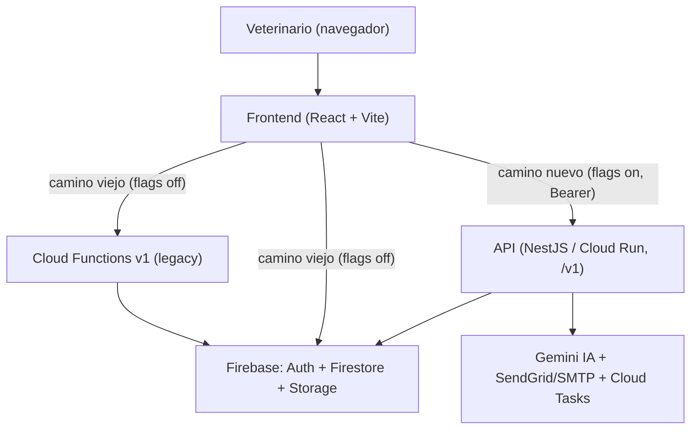

# VetIA

**VetIA** es una app de historias clínicas veterinarias: el veterinario registra pacientes y
consultas, graba el audio de la consulta, una IA lo transcribe y lo estructura en formato **SOAP**, y
se genera la historia clínica en PDF para compartir por email o WhatsApp. Multi-clínica, con roles.

Construida sobre **Firebase** (Auth, Firestore, Storage, Cloud Functions) con una **API NestJS** por
encima (estrategia *Strangler Fig*) y un **frontend React + Vite**.



El frontend usa **feature flags apagados por defecto**, así que hoy se comporta igual que siempre; la
API va absorbiendo responsabilidades (numeración de HC, IA, PDF, email) una a la vez, sin big-bang.

## Estructura del repo

```
api/        # API NestJS (contrato /v1) - ver api/README.md
frontend/   # SPA React + Vite - ver frontend/README.md
functions/  # Cloud Functions v1 (legacy, intactas en contrato)
docs/       # toda la documentación del proyecto
firebase.json, firestore.rules, storage.rules, firestore.indexes.json   # infra Firebase
.github/workflows/ci.yml   # CI (api, api-emulator, functions, frontend)
```

## Quickstart (local con emuladores)

Pre-requisitos: Node 20 y `firebase-tools` (`npm i -g firebase-tools`). PowerShell: encadená con `;`.

```powershell
# 1) Emuladores (terminal 1) - UI en http://localhost:4000
firebase emulators:start --project vethosia-production

# 2) API (terminal 2)
cd api ; copy .env.example .env ; npm install
$env:FIRESTORE_EMULATOR_HOST="127.0.0.1:8080"; $env:FIREBASE_AUTH_EMULATOR_HOST="127.0.0.1:9099"; $env:STORAGE_EMULATOR_HOST="http://127.0.0.1:9199"; $env:GCLOUD_PROJECT="vethosia-production"
npm run start:dev          # http://localhost:8080/v1/health

# 3) Frontend (terminal 3)
cd frontend ; copy .env.example .env.local ; npm install
npm run dev                # http://localhost:5173
```

Pasos detallados (migración, seed, deploy a Cloud Run, troubleshooting) en el
[RUNBOOK](./docs/RUNBOOK.md).

## Instalacion limpia Linux/CI

No reutilices `node_modules/` empaquetados ni artefactos locales. Para reconstruir dependencias desde
los lockfiles en Linux/CI:

```bash
rm -rf api/node_modules frontend/node_modules functions/node_modules api/dist frontend/dist functions/lib api/coverage frontend/coverage functions/coverage
npm ci --prefix api
npm ci --prefix frontend
npm ci --prefix functions
```

## Documentación

Toda la documentación vive en [`docs/`](./docs/README.md). Atajos:

- **[Refactorización paso a paso](./docs/PASO-A-PASO.md)** — qué se hizo y por qué. **Empezá acá.**
- **[Arquitectura](./docs/ARQUITECTURA.md)** — componentes, flujos y decisiones.
- **[Modelo de datos](./docs/DATA-MODEL.md)** — Firestore, multi-tenant, reglas, índices.
- **[API](./docs/API.md)** — contrato `/v1` y feature flags.
- **[Runbook](./docs/RUNBOOK.md)** — levantar, migrar, desplegar, troubleshooting.
- **[Testing](./docs/TESTING.md)** — estrategia de pruebas y convenciones.
- **[ADRs](./docs/ADR/)** — decisiones de arquitectura.

READMEs por paquete: [`api/README.md`](./api/README.md), [`frontend/README.md`](./frontend/README.md).
Notas de backend/infra: [`README.infra.md`](./README.infra.md).

## Tests y CI

| Frente | Comando | Estado |
|---|---|---|
| Frontend | `cd frontend ; npm run test:run` | Vitest + RTL (incluye guard anti claves IA) |
| API (unit) | `cd api ; npm run test:unit` | Jest (dominio: access, HC, consumo, suscripción, SOAP, Wompi, ...) |
| API (reglas/integración) | en CI (emulador Firebase) | job `api-emulator` |

El CI (`.github/workflows/ci.yml`) corre los jobs de API y frontend en cada PR y push a `main`.
**El job de frontend ahora corre `vitest` de verdad** (antes solo lint+build). Matriz
regla→test en [`docs/qa/matriz.md`](./docs/qa/matriz.md); plan de construcción del MVP en
[`docs/VETIA_MASTER_PROMPT`](./docs/) y decisiones en [`docs/ADR/`](./docs/ADR/). Deploy y
observabilidad en [`docs/DEPLOY.md`](./docs/DEPLOY.md).

## Stack

- **Frontend:** React 19, Vite, TypeScript, axios, Vitest, Playwright.
- **API:** NestJS, firebase-admin, pdfkit, Gemini, Cloud Tasks. Desplegable en Cloud Run.
- **Infra:** Firebase (Auth, Firestore, Storage, Functions). Proyecto `vethosia-production`.
