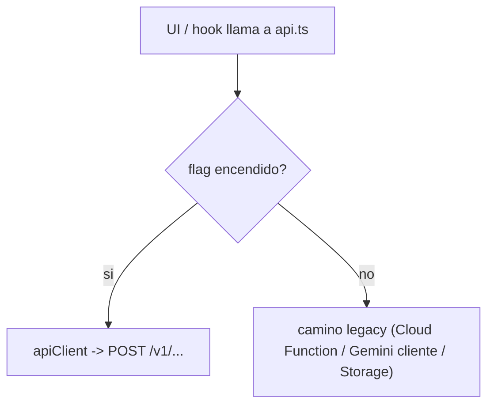

# API VetIA — contrato `/v1`

Referencia de cada endpoint de la API NestJS: método, auth, body, respuesta y errores. Más la
tabla de feature flags y cómo el frontend enruta entre el camino legacy y la API.

- **Base path:** `/v1` (configurable con `API_PREFIX`, default `v1`).
- **Base URL:** lo que tengas en `VITE_API_BASE_URL` (en local, `http://localhost:8080`).
- **Auth:** header `Authorization: Bearer <Firebase ID token>` salvo donde diga lo contrario.

El `AuthGuard` verifica el token con `firebase-admin` y carga los custom claims `{ orgId, rol }` en
`req.user`. Es **fail-closed**: sin token válido → `401`. Solo `@Public()` (health) se salta esto.

---

## Resumen de endpoints

| Método | Ruta | Auth | Rol | Éxito |
|---|---|---|---|---|
| GET | `/v1/health` | público | — | 200 |
| POST | `/v1/consultas/:id/hc` | Bearer | — | 200 |
| POST | `/v1/consultas/:id/pdf` | Bearer | — | 200 |
| POST | `/v1/consultas/:id/email` | Bearer | — | 200 |
| POST | `/v1/consultas/:id/procesar` | Bearer | — | 202 |
| POST | `/v1/ia/transcribir` | Bearer | — | 200 |
| POST | `/v1/ia/soap` | Bearer | — | 200 |
| POST | `/v1/ia/procesar` | worker secret / OIDC | — | 200 |
| POST | `/v1/organizaciones` | Bearer | — | 201 |
| POST | `/v1/organizaciones/:orgId/miembros` | Bearer | `admin` (misma org) | 201 |
| GET | `/v1/organizaciones/me` | Bearer | — | 200 |

**Errores comunes** (formato estándar de NestJS: `{ statusCode, message, error }`):

| Código | Cuándo |
|---|---|
| `400` | DTO inválido (lo tira el `ValidationPipe` global) |
| `401` | Falta el Bearer, token inválido/expirado, o worker secret incorrecto |
| `403` | Rol insuficiente, o el recurso es de otro tenant/dueño (`assertAcceso`) |
| `404` | La consulta/recurso no existe |

---

## Health

### `GET /v1/health`

- **Auth:** público (`@Public()`).
- **Respuesta:** `{ "status": "ok", "time": "2026-06-11T06:00:00.000Z" }`.
- **Uso:** health check del load balancer / `apiHealth()` del frontend.

---

## Consultas

Todas requieren Bearer. Internamente cargan la consulta y aplican `assertAcceso(user, consulta)`:
si el doc es de otro tenant/dueño → `403`.

### `POST /v1/consultas/:id/hc`

Genera (o devuelve) el número de historia clínica **por clínica**.

- **Body:** vacío.
- **Respuesta:** `{ "numeroHC": "HC000001" }`.
- **Notas:** transacción sobre `configuracion/contadorHC_{tenant}` (tenant = `orgId` o `vet_{uid}`
  en legacy). **Idempotente:** si la consulta ya tiene `numeroHC`, lo devuelve sin renumerar.

### `POST /v1/consultas/:id/pdf`

Genera el PDF de la historia y devuelve una URL firmada temporal.

- **Body:** vacío.
- **Respuesta:** `{ "url": "https://.../historiales/<id>.pdf?..." }`.
- **Notas:** arma el PDF con pdfkit, lo sube a `historiales/{id}.pdf` y devuelve `signedUrl` (1h en prod).

### `POST /v1/consultas/:id/email`

Envía la historia por email al propietario.

- **Body** (`EmailConsultaDto`):

| Campo | Tipo | Requerido | Validación |
|---|---|---|---|
| `emailDestinatario` | string | sí | email válido |
| `pdfUrl` | string | sí | URL con protocolo |
| `nombrePropietario` | string | no | — |
| `nombrePaciente` | string | no | — |
| `nombreVet` | string | no | — |

- **Respuesta:** `{ "success": true }`.
- **Notas:** usa el adaptador SendGrid/SMTP con **rate limit** por destinatario (default 5 envíos /
  60s). Si te pasás → error.

### `POST /v1/consultas/:id/procesar`

Encola el pipeline asíncrono de IA (transcribir + SOAP) para esa consulta.

- **Body** (`ProcesarConsultaDto`): `{ audioPath?, audioBase64?, mimeType? }` (al menos uno de
  `audioPath` / `audioBase64`).
- **Respuesta:** `202 Accepted` → `{ "estado": "procesando" }`.
- **Notas:** marca la consulta `estado: 'procesando'` y encola el job. El resultado lo escribe el
  worker (ver [ia/procesar](#post-v1iaprocesar-worker)). Si todo falla, la consulta queda en `error`.

---

## IA

### `POST /v1/ia/transcribir`

Transcribe audio a texto con Gemini (key server-side).

- **Body** (`TranscribirDto`): `{ audioPath?, audioBase64?, mimeType? }` (al menos uno de
  `audioPath` / `audioBase64`).
- **Respuesta:** `{ "transcripcion": "..." }`.

### `POST /v1/ia/soap`

Estructura una transcripción en formato SOAP.

- **Body** (`SoapDto`): `{ "transcripcion": "..." }` (requerido, no vacío).
- **Respuesta:** objeto `SoapResult`:

```json
{
  "motivo": "...",
  "prioridad": "rutina",
  "signosVitales": { "...": "..." },
  "subjetivo": "...",
  "objetivo": "...",
  "analisis": "...",
  "plan": "...",
  "medicamentosSugeridos": []
}
```

`prioridad` ∈ `urgente | rutina | seguimiento | brigada`. Mismo shape que el `generateSOAP` del
frontend legacy (por eso el flag se puede prender sin tocar la UI).

### `POST /v1/ia/procesar` (worker)

Endpoint que ejecuta el job de IA. **No es para el frontend**, lo invoca la cola.

- **Auth:** `@Public()` + `WorkerGuard`. Si `IA_WORKER_SECRET` está seteado, exige header
  `x-worker-secret`; si no, deja pasar (dev/emulador). Cloud Tasks puede usar OIDC además.
- **Body:** un `IaJob` `{ consultaId, orgId?, veterinarioId?, audioPath?, audioBase64?, mimeType?, intento? }`.
- **Respuesta:** `{ "ok": true }`.
- **Notas:** transcribe → guarda transcripción → genera SOAP → guarda con `estado: 'borrador'`. Si
  algo falla, deja la consulta en `estado: 'error'` y re-lanza para que la cola reintente.

---

## Tenant (organizaciones)

### `POST /v1/organizaciones`

Crea una organización y deja al caller como `admin`.

- **Body** (`CrearOrgDto`): `{ nombre (min 2), plan?: 'free'|'pro'|'enterprise', ciudad? }`.
- **Respuesta:** `{ "orgId": "..." }`.
- **Efecto:** crea el doc en `organizaciones`, te agrega a `miembros` como `admin` y setea tus
  custom claims `{ orgId, rol: 'admin' }`.

### `POST /v1/organizaciones/:orgId/miembros`

Alta de un miembro en la organización (y le setea claims).

- **Auth:** Bearer + `@Roles('admin')` + chequeo manual `user.orgId === orgId`.
- **Body** (`AsignarMiembroDto`): `{ uid, rol: 'admin'|'vet'|'asistente' }`.
- **Respuesta:** `{ "orgId": "...", "rol": "..." }`.
- **Notas:** escribe `miembros/{uid}` y mergea custom claims `{ orgId, rol }` en Auth.

### `GET /v1/organizaciones/me`

Devuelve la membresía del usuario actual.

- **Respuesta:** `{ "orgId": "..." | null, "rol": "..." | null }`.

> No hay un endpoint separado de "set claims": los custom claims se setean dentro de
> `crearOrganizacion` y `asignarMiembro`.

---

## Feature flags

El frontend decide camino viejo vs API por flag (en `frontend/src/lib/featureFlags.ts`). Todos
**apagados por defecto** → comportamiento idéntico al actual.

| Flag (env) | Default | Camino OFF (viejo) | Camino ON (API) |
|---|---|---|---|
| `VITE_USE_API_HC` | `false` | Cloud Function `generarNumeroHC` (contador global) | `POST /v1/consultas/:id/hc` |
| `VITE_USE_API_IA` | `false` | Gemini desde el navegador | `POST /v1/ia/transcribir` + `/v1/ia/soap` |
| `VITE_USE_API_DOCS` | `false` | PDF subido a mano + Cloud Function de email | `POST /v1/consultas/:id/pdf` y `/email` |

Valores aceptados como "true": `true`, `1`, `on`, `yes` (case-insensitive). Cualquier otra cosa = `false`.

```9:21:c:\Users\LENOVO\Documents\VetIA-main\frontend\src\lib\featureFlags.ts
export const getFeatureFlags = (): FeatureFlags => ({
  useApiHC: parseBool(import.meta.env.VITE_USE_API_HC),
  useApiIA: parseBool(import.meta.env.VITE_USE_API_IA),
  useApiDocs: parseBool(import.meta.env.VITE_USE_API_DOCS),
});
```

> **Nota de drift (corregida):** el `.env.example` viejo listaba `VITE_USE_API_EMAIL` y
> `VITE_USE_API_PDF`, pero el código lee un único `VITE_USE_API_DOCS` para PDF **y** email. Se
> actualizó el `.env.example` para reflejar lo real.

---

## Cómo enruta el frontend (legacy vs API)

La capa `frontend/src/features/consultas/api.ts` es la que mira el flag y elige. Patrón:



- **`generarNumeroHC`** → `useApiHC` ? API : Cloud Function callable.
- **`transcribirAudio` / `generarSOAP`** → `useApiIA` ? API : `services/gemini.ts` + `whisper.ts`.
- **`obtenerUrlPDF` / `enviarHistorialEmail`** → `useApiDocs` ? API : Storage + Cloud Function.

El token Bearer lo agrega solo el interceptor de `apiClient` (lee `auth.currentUser.getIdToken()`),
así que el código de cada feature no se preocupa por la auth.

---

## Configuración por entorno (API)

Variables que lee la API (de `api/src/common/config/env.ts` y `main.ts`). Lista completa con
defaults en el [RUNBOOK](./RUNBOOK.md#variables-de-entorno-api).

| Grupo | Vars |
|---|---|
| App | `PORT`, `API_PREFIX`, `CORS_ORIGIN`, `FIREBASE_PROJECT_ID`, `GCLOUD_PROJECT`, `STORAGE_BUCKET` |
| Emuladores | `FIRESTORE_EMULATOR_HOST`, `FIREBASE_AUTH_EMULATOR_HOST`, `STORAGE_EMULATOR_HOST` |
| Gemini | `GEMINI_API_KEY`, `GEMINI_MODEL`, `GEMINI_BASE_URL` |
| Email | `SENDGRID_API_KEY`, `EMAIL_FROM/USER/HOST/PORT/SECURE/PASS`, `EMAIL_RATE_LIMIT_MAX/WINDOW_MS` |
| Cola | `QUEUE_DRIVER`, `CLOUD_TASKS_LOCATION/QUEUE`, `IA_WORKER_URL`, `CLOUD_TASKS_INVOKER_SA`, `IA_WORKER_SECRET` |

---

> Relacionado: [ARQUITECTURA](./ARQUITECTURA.md) (flujo de request), [DATA-MODEL](./DATA-MODEL.md)
> (qué leen/escriben estos endpoints) y [RUNBOOK](./RUNBOOK.md) (cómo levantar todo).
