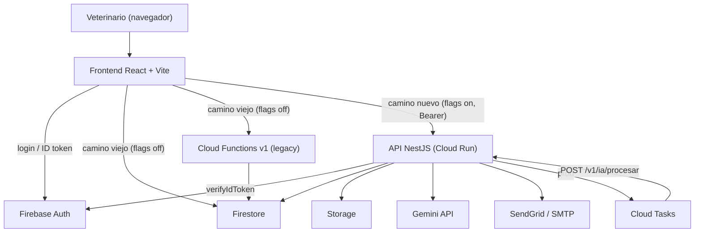
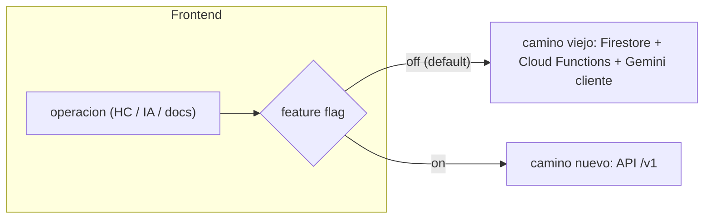
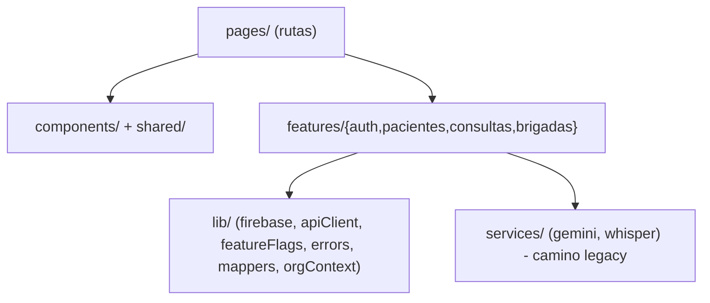
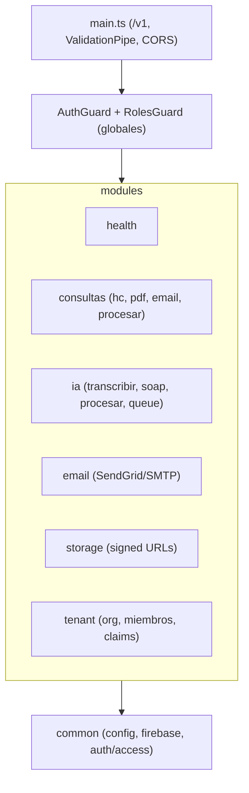
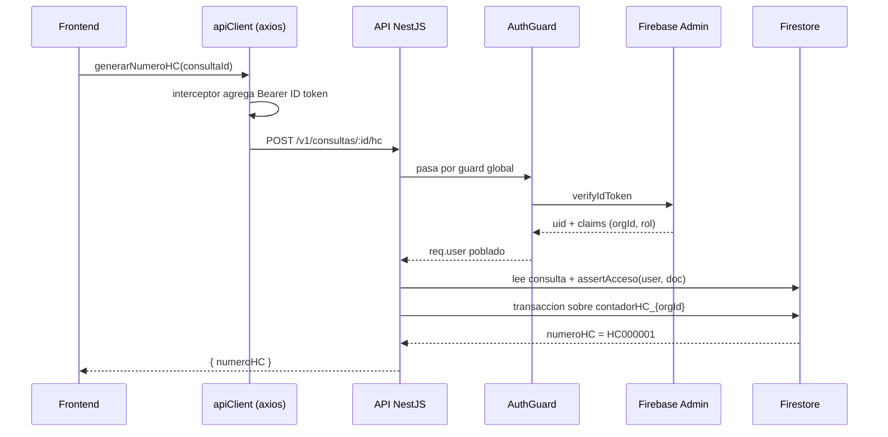
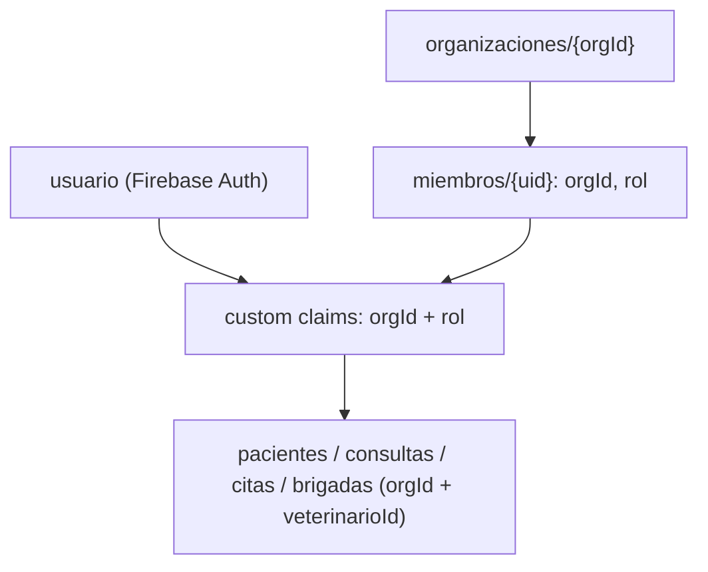
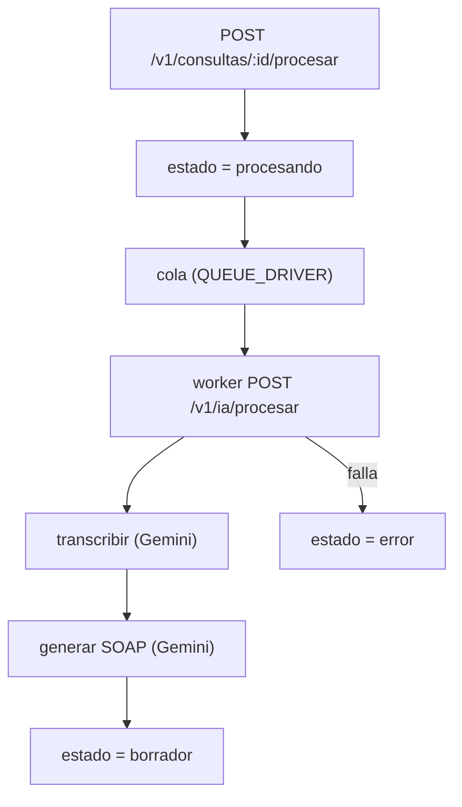

# Arquitectura de VetIA

Este documento describe la **arquitectura objetivo** después de la refactorización: cómo encajan
las piezas, cómo viaja un request y por qué tomamos las decisiones que tomamos. Si querés el relato
cronológico de qué se hizo, andá a [PASO-A-PASO](./PASO-A-PASO.md). Si querés el detalle de datos o
de endpoints, mirá [DATA-MODEL](./DATA-MODEL.md) y [API](./API.md).

---

## Vista de 10.000 pies

VetIA es una app de historias clínicas veterinarias. Tiene tres piezas que corren y conviven:

- **Frontend** (React + Vite + TypeScript): la SPA que usa el veterinario.
- **API** (NestJS sobre Cloud Run): la capa nueva, contrato `/v1`, dueña de la lógica sensible.
- **Firebase**: Auth (identidad), Firestore (datos), Storage (audios y PDFs) y Cloud Functions
  (las callables originales, que siguen vivas durante la transición).

El truco central: el frontend puede pegarle al **camino viejo** (Firestore directo + Cloud
Functions + Gemini en el cliente) o al **camino nuevo** (la API). Lo decide por feature flag, una
operación a la vez.

---

## Estrategia: Strangler Fig

No reescribimos todo de cero (riesgoso y largo). Aplicamos el patrón **Strangler Fig**: una nueva
fachada (la API) crece alrededor del sistema viejo y le va "estrangulando" responsabilidades hasta
reemplazarlo, sin un corte big-bang.

**Por qué nos gusta:**

- **Riesgo bajo:** los flags arrancan apagados; el comportamiento es idéntico al de hoy.
- **Migración incremental:** prendés un flag, lo observás en prod, y si algo se rompe lo apagás.
- **Reversibilidad:** rollback instantáneo cambiando una variable de entorno, sin redeploy del back.

Los tres flags (en `frontend/src/lib/featureFlags.ts`):

| Flag | Enciende |
|---|---|
| `VITE_USE_API_HC` | Numeración de HC por la API |
| `VITE_USE_API_IA` | Transcripción + SOAP por la API |
| `VITE_USE_API_DOCS` | PDF + email por la API |

Detalle de cada uno y su contraparte legacy en [API.md](./API.md#feature-flags).

---

## Componentes y responsabilidades

### Frontend (`frontend/`)

Organizado en capas para que la lógica sea testeable y la UI delgada.

- **`lib/`** — base reusable: init de Firebase, cliente HTTP con Bearer, flags, errores tipados,
  mappers `Timestamp<->Date`, contexto de organización.
- **`features/<feature>/`** — `api.ts` (acceso a datos / capa Strangler) + `hooks.ts` (estado React).
- **`pages/`** y **`components/`/`shared/`** — UI. Las rutas viejas (`hooks/`, `services/firebase.ts`)
  quedaron como **shims de re-export** para no romper imports.

### API (`api/`)

NestJS modular. `main.ts` levanta el prefijo `/v1`, `ValidationPipe` global y dos guards globales.

- **`common/`** — `config/env.ts` (toda la config tipada por env), `firebase/` (Admin SDK como
  módulo global + nombres de colecciones), `auth/` (guards, decoradores, `access.ts`).
- **`modules/`** — cada dominio aislado; ver responsabilidades en [API.md](./API.md).

### Firebase

- **Auth** — identidad (Google sign-in). Los **custom claims** `{ orgId, rol }` viajan en el ID token.
- **Firestore** — base de datos. Reglas con aislamiento owner+tenant (ver [DATA-MODEL](./DATA-MODEL.md)).
- **Storage** — `audios/{uid}/**` y `historiales/**` con límites de tamaño y content-type.
- **Cloud Functions v1** — `generarNumeroHC` y `enviarHistorialEmail`, intactas en contrato; el email
  ya usa `defineSecret` + adaptador SendGrid/SMTP.

---

## Flujo de un request con la API

Ejemplo: numerar una historia clínica con el flag `VITE_USE_API_HC` encendido.

Puntos clave del flujo:

1. **El token lo pone el interceptor** de `apiClient` automáticamente (`auth.currentUser.getIdToken()`).
2. **`AuthGuard` es fail-closed:** sin token válido → `401`. Solo `@Public()` (health) se salta esto.
3. **`assertAcceso`** valida que el doc pertenezca al tenant/dueño del usuario → `403` si no.
4. **La transacción es por clínica** (`contadorHC_{orgId}`), eliminando la contención del doc global.

---

## Modelo multi-tenant (resumen)

- Una **organización** = una clínica. Cada usuario es **miembro** de una org con un **rol**
  (`admin | vet | asistente`).
- El aislamiento se aplica en **dos lados**: reglas de Firestore (camino viejo, acceso directo) y
  `assertAcceso` en la API (camino nuevo).
- Convivencia legacy: si un doc todavía no tiene `orgId`, se cae al dueño por `veterinarioId == uid`.

Detalle completo (colecciones, reglas, índices) en [DATA-MODEL](./DATA-MODEL.md).

---

## Pipeline de IA asíncrono

- **`QUEUE_DRIVER=inmemory`** (dev): mismo proceso, reintentos con backoff exponencial (máx 3).
- **`QUEUE_DRIVER=cloudtasks`** (prod): Cloud Tasks hace `POST` al worker; el `WorkerGuard` valida
  con `x-worker-secret` y/o OIDC.
- Si todo falla, la consulta queda en `estado: 'error'` (no hay huérfanas silenciosas).

---

## Decisiones clave (y por qué)

| Decisión | Por qué | ADR |
|---|---|---|
| Strangler Fig sobre Firebase + API NestJS | Migrar sin big-bang, con rollback por flag | [ADR-0001](./ADR/ADR-0001-strangler-fig-firebase-nestjs.md) |
| HC particionado **por clínica**, no sharded | Mata la contención del contador global sin la complejidad de leer N shards | [ADR-0002](./ADR/ADR-0002-hc-particionado-por-clinica.md) |
| Multi-tenant por `orgId` + custom claims | El aislamiento viaja en el ID token; lo aplican reglas y API sin lookups extra | [ADR-0003](./ADR/ADR-0003-multitenant-orgid-claims.md) |
| Secretos server-side (Gemini, email) | Sacar la key del navegador; usar `defineSecret`/env | — |
| Cola intercambiable por env | Dev sin GCP (in-memory), prod robusto (Cloud Tasks), mismo código | — |
| NestJS sobre Cloud Run | Framework modular + tipado fuerte; Cloud Run escala a cero y es barato | [ADR-0001](./ADR/ADR-0001-strangler-fig-firebase-nestjs.md) |

---

## Restricciones y supuestos

- **El front nunca habla con Gemini con flags encendidos.** La key vive solo server-side.
- **CORS** está abierto por defecto; en prod conviene restringir con `CORS_ORIGIN`.
- **El contador HC nunca es escribible desde el cliente** (solo Admin SDK).
- **Compatibilidad legacy** es first-class: nada de lo viejo se rompe mientras los flags estén
  apagados. Cuando todo tenga `orgId`, se puede retirar el fallback por `veterinarioId`.

---

> Siguiente lectura recomendada: [DATA-MODEL](./DATA-MODEL.md) para entender el almacenamiento, o
> [API](./API.md) para el contrato de cada endpoint.
