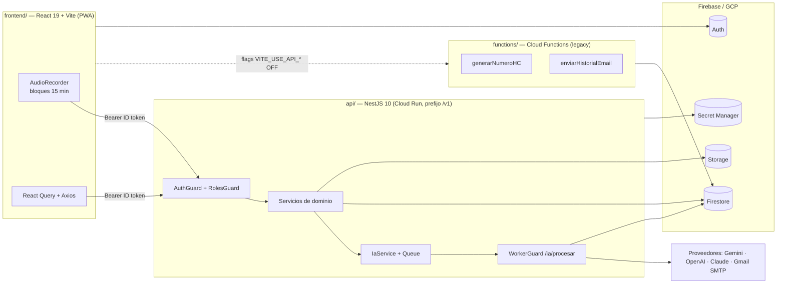
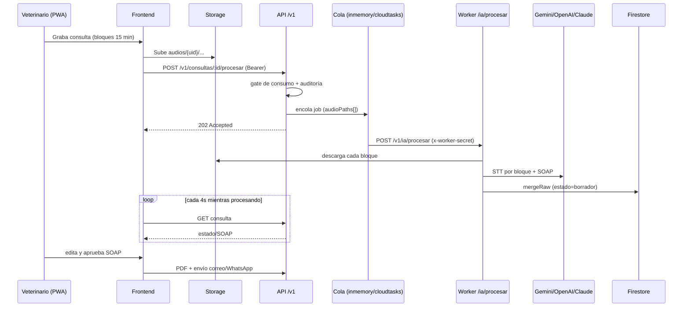

# Auditoría y entendimiento — Vethos AI (VetIA)

> Fecha de corte: 2026-06-25 · Proyecto en la nube: `vethosia-5895b` · Rama: `main`
>
> Documento de auditoría técnica y plan de remediación. Cruza el estado real del código con
> los documentos de entrega `ENTREGA-ANDRES.md` y de alcance `ALCANCES-VETHOS.md`.
> Idioma de docs en español; identificadores de código en inglés (regla `00-global`).

---

## 1. Resumen ejecutivo

Vethos AI (VetIA) es un SaaS clínico veterinario **multi-tenant** (PWA) cuyo flujo estrella
convierte una consulta hablada en una **historia clínica SOAP**: el veterinario **graba** →
se **transcribe** (STT) → la IA arma el **SOAP** estructurado → el profesional **edita/aprueba**
→ se genera **PDF** y se **envía** por correo / WhatsApp. Alrededor: pacientes, agenda
(calendario), vacunas, brigadas, planes/suscripciones, métricas y administración por roles.

Estado de madurez: **MVP funcional y demostrable** (probado end-to-end), en fase de pruebas
con veterinarios reales y desplegable a producción en el ambiente propio (`vethosia-5895b`).

Composición del repositorio:

| Carpeta | Contenido |
|---------|-----------|
| `api/` | API NestJS 10 (contrato `/v1`, Cloud Run). Dominio, auth, config, firebase. |
| `frontend/` | React 19 + Vite + TypeScript + Tailwind (PWA). |
| `functions/` | Cloud Functions legacy (`generarNumeroHC`, `enviarHistorialEmail`). |
| `docs/` | Documentación histórica, ADRs, QA (`docs/qa/matriz.md`). |
| Raíz | `firebase.json`, `.firebaserc`, `firestore.rules`, `firestore.indexes.json`, `storage.rules`, `cors.json`, `env.prod.yaml`. |

Principios no negociables verificados en el código: el frontend **solo habla con `/v1`**,
**sin claves de IA en el navegador**, sin lógica de tenant en el cliente; autorización en la
API por `orgId` (y RBAC V2); secretos solo server-side; CI con lint + typecheck + tests.

---

## 2. Arquitectura

Patrón **Strangler Fig**: el frontend migra de Firestore directo + Cloud Functions hacia la
API `/v1` mediante flags `VITE_USE_API_*`. RBAC multi-tenant V2 vía custom claims de Firebase.

Stack (según `ENTREGA-ANDRES.md` §2 y verificado en código):

| Capa | Tecnología |
|------|------------|
| Frontend | React 19 + Vite + TypeScript + Tailwind (PWA) |
| API | NestJS 10 (TypeScript) en Cloud Run |
| Datos | Firebase: Auth, Firestore, Storage |
| STT (voz→texto) | Gemini primario · OpenAI fallback (en prod) |
| SOAP (texto→HC) | Anthropic Claude primario · Gemini fallback |
| Correo | Gmail SMTP (`gerencia@vethosia.com`) / SendGrid |

---

## 3. Backend (`api/`)

### 3.1 Bootstrap

[api/src/main.ts](../api/src/main.ts): `validateEnv()` fail-fast antes de arrancar; prefijo
global `/v1` (`API_PREFIX`); `ValidationPipe` global (`whitelist` + `transform`); CORS
**cerrado en prod** salvo `CORS_ORIGIN`; body limit 50 MB (audio inline); puerto 8080 por
defecto (Cloud Run inyecta `PORT`). Guards globales `AuthGuard` + `RolesGuard` vía `APP_GUARD`
en [api/src/app.module.ts](../api/src/app.module.ts).

### 3.2 Auth y multi-tenancy

[api/src/common/auth/auth.guard.ts](../api/src/common/auth/auth.guard.ts): el guard global
verifica el **Firebase ID token** y construye `req.user` con claims legacy (`orgId`, `rol`) y
**V2** (`role`, `accountType`, `accountId`, `entidadId`, `veterinariaId`, `membershipId`...).

- Roles legacy: `superadmin` | `admin` | `vet` | `asistente`.
- Roles V2: `superadmin` | `admin_entidad` | `admin_veterinaria` | `veterinario`.
- `RolesGuard` mapea jerarquía V2→legacy ([api/src/common/auth/roles.guard.ts](../api/src/common/auth/roles.guard.ts)).
- Decoradores: `@Public()` (salta auth), `@Roles(...)` (rol mínimo), `@CurrentUser()`.
- Aislamiento por tenant en capa de servicio: `assertAcceso()` / `assertOperacionClinica()`
  en [api/src/common/auth/access.ts](../api/src/common/auth/access.ts), y V2 en
  [api/src/common/auth/access-v2.ts](../api/src/common/auth/access-v2.ts) y
  [api/src/common/auth/runtime-v2.ts](../api/src/common/auth/runtime-v2.ts)
  (filtra por `entidadId` / `veterinariaId` / `accountId` o asignación explícita).

### 3.3 Configuración y secretos

[api/src/common/config/env.schema.ts](../api/src/common/config/env.schema.ts): esquema Zod
validado al arranque. En producción exige: sin mocks (`IA_MOCK`/`EMAIL_MOCK`), claves del
proveedor elegido (`STT_PROVIDER`/`LLM_PROVIDER`), `IA_WORKER_SECRET` ≥32 chars, `INVITE_SECRET`
fuerte, e `IA_WORKER_URL` si `QUEUE_DRIVER=cloudtasks`. Firebase Admin se inicializa de forma
idempotente vía ADC en [api/src/common/firebase/firebase.service.ts](../api/src/common/firebase/firebase.service.ts).

### 3.4 Flujo de IA

[api/src/modules/ia/ia.service.ts](../api/src/modules/ia/ia.service.ts) orquesta el pipeline
asíncrono:

| Ruta | Auth | Propósito |
|------|------|-----------|
| `POST /v1/ia/transcribir` | JWT usuario | STT síncrono |
| `POST /v1/ia/soap` | JWT usuario | SOAP síncrono desde transcripción |
| `POST /v1/consultas/:id/procesar` | JWT usuario | Encola pipeline async (202) |
| `POST /v1/ia/procesar` | `@Public()` + `WorkerGuard` | Worker ejecuta el job |

Pipeline async: subida de bloques a Storage (`audios/{uid}/...`) → `prepararProcesamiento`
(gate de consumo + auditoría) → encolar → worker descarga cada `audioPaths[]` (hasta 20),
transcribe bloque a bloque, **une con `\n\n`**, genera SOAP y hace `mergeRaw` (estado `borrador`).

- Proveedores con fallback en [api/src/modules/ia/providers/resolve-ia-providers.ts](../api/src/modules/ia/providers/resolve-ia-providers.ts).
  Default de código `STT_PROVIDER=openai`, pero `env.prod.yaml` fija `gemini` → en prod
  coincide con los docs (Gemini→OpenAI para STT; Claude→Gemini para SOAP).
- Cola: `inmemory` (default, 3 reintentos con backoff) o `cloudtasks` (POST a `IA_WORKER_URL`).
- `WorkerGuard` ([api/src/modules/ia/worker.guard.ts](../api/src/modules/ia/worker.guard.ts)):
  fail-closed en prod si falta `IA_WORKER_SECRET`; valida el header `x-worker-secret`.

### 3.5 Otros módulos de dominio

`consultas` (HC#, PDF con `pdfkit`, email), `pacientes`/historial, `citas` (agenda),
`vacunas` (catálogo por veterinaria), `brigadas`, `saas` (planes, suscripciones con máquina de
estados, consumo de IA, **Wompi** con webhook firmado), `plataforma` (notificaciones, métricas,
auditoría, cron jobs), `storage` (signed URLs 1h), `email` (SendGrid/SMTP), `health`.

### 3.6 Tests y empaquetado

~50 specs Jest en 3 proyectos (unit 43, integration 5, rules 2) — [api/jest.config.js](../api/jest.config.js).
`Dockerfile` multi-stage Node 20 que expone 8080 y no hornea secretos.

---

## 4. Frontend (`frontend/`)

### 4.1 Estructura y routing

[frontend/src/App.tsx](../frontend/src/App.tsx): stack de providers (React Query v5,
UIProviders, AuthProvider, BrowserRouter v7). `ProtectedRoute` + `Layout`, y guards por
capacidad/rol: `ClinicalRoute`, `BrigadasRoute`, `SubscriptionRoute`, `RoleRoute`. Fuente de
verdad RBAC en [frontend/src/lib/rbac.ts](../frontend/src/lib/rbac.ts) y
[frontend/src/lib/capabilities.ts](../frontend/src/lib/capabilities.ts). El Dashboard enruta a
"command centers" por rol.

### 4.2 Capa de comunicación con la API

[frontend/src/lib/apiClient.ts](../frontend/src/lib/apiClient.ts): Axios singleton con
interceptor que inyecta `Authorization: Bearer <ID token>` (refresh forzado tras login/cambio
de uid). 401 → cierre de sesión; 403 → acceso denegado. `baseURL` desde `VITE_API_BASE_URL`;
en build de prod se inyecta la URL de Cloud Run y [frontend/scripts/verify-prod-build.mjs](../frontend/scripts/verify-prod-build.mjs)
bloquea `localhost`/keys falsas en `dist/`.

### 4.3 Strangler Fig (flags)

[frontend/src/lib/featureFlags.ts](../frontend/src/lib/featureFlags.ts):

| Flag | Conmuta |
|------|---------|
| `VITE_USE_API_HC` | HC vía API vs Cloud Function `generarNumeroHC` |
| `VITE_USE_API_IA` | IA async (Cloud Tasks) vs pipeline síncrono |
| `VITE_USE_API_DOCS` | PDF/email vía API vs jsPDF cliente + CF |
| `VITE_USE_API_CRUD` | CRUD vía `/v1/*` vs Firestore directo |
| `VITE_EMAIL_REAL_ENABLED` | Envío real vs toast demo |

Por defecto **OFF** en `.env.example` (camino legacy). La transcripción/SOAP **siempre** van a
`/v1/ia/*` (no hay Gemini en el cliente; lo verifica el test
[frontend/src/test/noClientAiKeys.test.ts](../frontend/src/test/noClientAiKeys.test.ts)).

### 4.4 Grabación por bloques y polling

[frontend/src/components/AudioRecorder.tsx](../frontend/src/components/AudioRecorder.tsx):
`MediaRecorder` mono 32 kbps, bloques de 15 min (`BLOQUE_MAX_MS = 15*60*1000`, aviso al 12),
multi-bloque. Sube a `audios/{uid}/{consultaId}-{i}.webm`. `DetalleConsulta` hace **polling
cada 4 s** mientras `estado === 'procesando'`.

### 4.5 PWA, estado y tests

`vite-plugin-pwa` con `registerType: autoUpdate`, runtime cache `NetworkFirst` para `/v1*`,
install prompt. Estado de servidor con **React Query**; algunos hooks legacy usan `useState`.
~83 tests (77 Vitest + 6 Playwright E2E).

---

## 5. Comunicación y comportamiento

El frontend solo consume `/v1` con el ID token; el backend usa Admin SDK (se salta reglas
Firestore) y autoriza por `orgId`/V2. El procesamiento de IA es asíncrono y el front refleja
el progreso por polling.

---

## 6. Despliegue

- **Frontend** → Firebase Hosting (`firebase deploy --only hosting`), `public: frontend/dist`,
  rewrites SPA hacia `/index.html` ([firebase.json](../firebase.json)).
- **API** → Cloud Run vía `gcloud builds submit` + `gcloud run deploy` con
  `--no-invoker-iam-check` (la org bloquea `allUsers`), `--no-cpu-throttling` (que la cola en
  memoria no se congele tras responder), `--env-vars-file env.prod.yaml` y `--set-secrets`
  desde **Secret Manager** (`ANTHROPIC/OPENAI/GEMINI_API_KEY`, `INVITE_SECRET`, `EMAIL_PASS`).
- **Auth en runtime**: por **ADC** (la org bloquea descargar llaves de service account). En
  local, firmar signed URLs falla (esperado); funciona en prod con la service account de Cloud Run.
- **CI** ([.github/workflows/ci.yml](../.github/workflows/ci.yml)): jobs api / api-emulator /
  functions / frontend (lint + typecheck + tests + build). **No hay CD**: el deploy es manual.

---

## 7. Controles de seguridad positivos

- Config tipada y fail-fast (Zod) que bloquea arranques inseguros en prod.
- Sin claves de IA en el cliente, con test automático que lo verifica.
- `verify-prod-build.mjs` bloquea bundles con `localhost`/keys falsas.
- `firestore.rules` con deny catch-all (`match /{document=**} { allow read, write: if false }`)
  y escrituras sensibles (suscripciones, consumos, pagos, auditoría, configuración,
  invitaciones) bloqueadas al cliente.
- Tests negativos de aislamiento por tenant (API y reglas).
- `WorkerGuard` fail-closed en prod.

---

## 8. Registro de hallazgos

Severidad: **C** crítico · **A** alto · **M** medio · **B** bajo/informativo.

| # | Sev | Hallazgo | Ubicación |
|---|-----|----------|-----------|
| H1 | C | `IA_WORKER_SECRET` en **texto plano y versionado** (`vetia-production-worker-secret-key-32-chars-long`). `env.prod.yaml` **no** está en `.gitignore`. | [env.prod.yaml](../env.prod.yaml) L18 |
| H2 | C | Secretos reales listados (Anthropic, OpenAI, Gemini, app password Gmail, `INVITE_SECRET`); el propio doc pide rotarlas y reconoce que "estuvieron en chats". | `ENTREGA-ANDRES.md` §5 |
| H3 | A | **OIDC de Cloud Tasks no se verifica**: el worker solo valida `x-worker-secret`, aunque la regla de seguridad exige OIDC en prod. Endpoint `@Public()` y Cloud Run alcanzable públicamente. | [api/src/modules/ia/worker.guard.ts](../api/src/modules/ia/worker.guard.ts) · `.cursor/rules/30-security.mdc` |
| H4 | A | `QUEUE_DRIVER=inmemory` en prod: cola **no durable** (se pierde si la instancia recicla). Pendiente migrar a `cloudtasks`. | [env.prod.yaml](../env.prod.yaml) L15 |
| H5 | M | Discrepancia de proyecto/URLs: repo apunta a `vethosia-5895b`, varios `docs/` describen `vethosia-production` con otra URL de Cloud Run (`cwepwj6irq` vs `awdlgzrxkq`). | `docs/VETHOSIA_PROD.md`, `docs/DEPLOY.md` |
| H6 | M | Doble numeración HC: Cloud Function `generarNumeroHC` (contador global) vs `/v1/consultas/:id/hc` (por veterinaria) según flags. | [functions/index.js](../functions/index.js) · `docs/SCOPE_V2_GAP_ANALYSIS.md` |
| H7 | M | Storage `historiales/{orgId}` permite **lectura directa** del cliente por miembro de la org, mientras la regla documentada prefiere solo signed URLs. | [storage.rules](../storage.rules) |
| H8 | M | `fotos-veterinarios/{uid}` legible por **cualquier usuario autenticado**. | [storage.rules](../storage.rules) |
| H9 | M | Fallback legacy en `firestore.rules` (docs sin `orgId`): ventana de aislamiento hasta completar la migración. | [firestore.rules](../firestore.rules) |
| H10 | M | Seeds con password fija `Vethos2026!` apuntando al proyecto real. | [api/scripts/seed-ximenavet.ts](../api/scripts/seed-ximenavet.ts) |
| H11 | B | Hosting sin headers de seguridad (CSP/HSTS/X-Frame-Options). | [firebase.json](../firebase.json) |
| H12 | B | CI no corre E2E, ni `verify-prod-build.mjs`, ni escaneo de secretos; no hay CD. | [.github/workflows/ci.yml](../.github/workflows/ci.yml) |
| H13 | B | `planes/{planId}` legible por cualquier autenticado (probablemente intencional, catálogo). | [firestore.rules](../firestore.rules) |

### Trazabilidad
La matriz de reglas de negocio y su cobertura de tests vive en
[docs/qa/matriz.md](qa/matriz.md). Filas relevantes para seguridad: R4 (aislamiento por
tenant), R6 (config no escribible por cliente), R13 (worker fail-closed), R19 (aislamiento de
PDF), R31 (sin claves de IA en el bundle), R92 (denegación cross-tenant en Storage), R119
(secretos Wompi solo en Secret Manager).

---

## 9. Plan de remediación priorizado

Esfuerzo: **S** (&lt;0.5 día) · **M** (0.5–2 días) · **L** (&gt;2 días).
Las acciones de rotación de secretos requieren pasos manuales en consola/GCP (no se ejecutan
automáticamente).

### P0 — Inmediato (seguridad de secretos)

| Riesgo | Acción | Esf. | Archivos |
|--------|--------|------|----------|
| H1 | Mover `IA_WORKER_SECRET` a Secret Manager y referenciarlo con `--set-secrets`; quitarlo de `env.prod.yaml`; añadir `env.prod.yaml` a `.gitignore`. | S | [env.prod.yaml](../env.prod.yaml), `.gitignore` |
| H1 | **Rotar** el `IA_WORKER_SECRET` actual (quedó expuesto en git). | S | GCP Secret Manager |
| H2 | **Rotar** todas las claves de proveedor y el app password de Gmail; auditar el historial git por exposición previa. | M | Anthropic/OpenAI/Gemini/Gmail/GSM |

### P0/P1 — Endurecimiento del worker y cola

| Riesgo | Acción | Esf. | Archivos |
|--------|--------|------|----------|
| H3 | Verificar el **OIDC JWT** de Cloud Tasks en el worker (no solo el header) en prod. | M | [api/src/modules/ia/worker.guard.ts](../api/src/modules/ia/worker.guard.ts) |
| H4 | Migrar a `QUEUE_DRIVER=cloudtasks` y configurar `IA_WORKER_URL`, `CLOUD_TASKS_*`, `CLOUD_TASKS_INVOKER_SA`. | M | [env.prod.yaml](../env.prod.yaml), [api/src/modules/ia/queue/cloud-tasks-queue.service.ts](../api/src/modules/ia/queue/cloud-tasks-queue.service.ts) |

### P1 — Consistencia y reglas

| Riesgo | Acción | Esf. | Archivos |
|--------|--------|------|----------|
| H5 | Unificar el proyecto/URL canónico; actualizar `docs/` para que todos apunten a `vethosia-5895b` (o decidir el destino real). | M | `docs/VETHOSIA_PROD.md`, `docs/DEPLOY.md` |
| H6 | Unificar numeración HC en una sola fuente (API por veterinaria) y deprecar la Cloud Function. | M | [functions/index.js](../functions/index.js), [frontend/src/features/consultas/api.ts](../frontend/src/features/consultas/api.ts) |
| H7 | Servir `historiales/{orgId}` solo por signed URL temporal; restringir lectura directa. | M | [storage.rules](../storage.rules) |
| H8 | Restringir `fotos-veterinarios` a dueño / miembros de su org. | S | [storage.rules](../storage.rules) |

### P2 — Higiene y hardening

| Riesgo | Acción | Esf. | Archivos |
|--------|--------|------|----------|
| H11 | Añadir headers de seguridad (CSP, HSTS, X-Frame-Options, X-Content-Type-Options) en Hosting. | S | [firebase.json](../firebase.json) |
| H12 | Añadir E2E, `verify-prod-build.mjs` y escaneo de secretos al CI; evaluar un pipeline de CD. | M | [.github/workflows/ci.yml](../.github/workflows/ci.yml) |
| H9 | Completar la migración multi-tenant y **eliminar el fallback legacy** sin `orgId`. | L | [firestore.rules](../firestore.rules), [api/scripts/migrate.ts](../api/scripts/migrate.ts) |
| H10 | Mover password de seeds a variable de entorno; guardas anti-prod en seeds de demo. | S | [api/scripts/seed-ximenavet.ts](../api/scripts/seed-ximenavet.ts) |

### Cierre de "Pendientes" de la entrega (`ENTREGA-ANDRES.md` §8)
- Migrar la cola de IA a Cloud Tasks (H4).
- Reproductor multi-bloque de audio (hoy reproduce solo el primer bloque).
- Conectar dominio propio `vethosia.com` al Hosting.
- Quitar "Crear cuenta" del login (no hay auto-registro).
- Rotar API keys y app password (H2).
