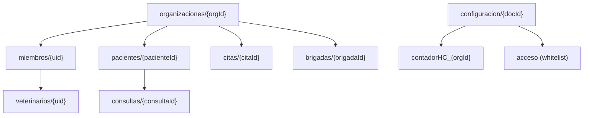
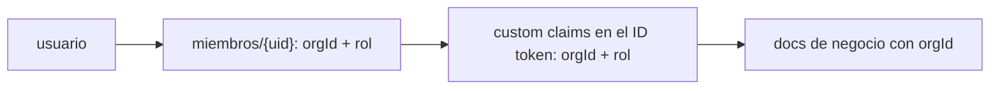
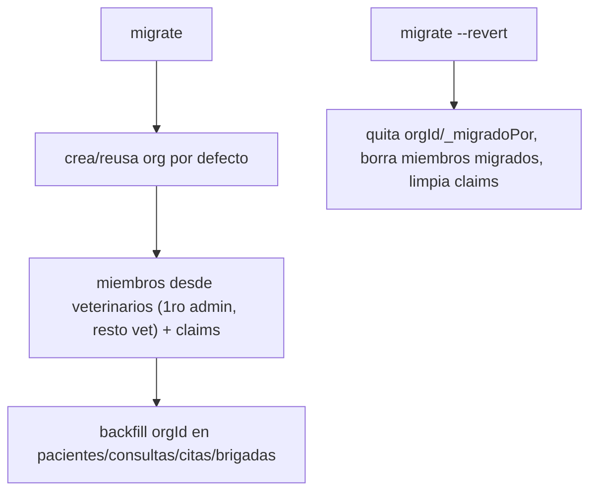

# Modelo de datos de VetIA

Cómo se guardan las cosas: colecciones de Firestore, el modelo multi-tenant, cómo las reglas aíslan
por organización y qué índices existen. Las fuentes de verdad son `firestore.rules`,
`storage.rules`, `firestore.indexes.json` y `api/src/common/firebase/collections.ts`.

---

## Colecciones de Firestore

Nombres reales (de `api/src/common/firebase/collections.ts`):

```ts
organizaciones, miembros, veterinarios, pacientes, consultas, citas, brigadas, configuracion
```



### `organizaciones/{orgId}`

La clínica. Campos: `{ nombre, plan?: 'free'|'pro'|'enterprise', ciudad?, creadoEn }`.

### `miembros/{uid}`

Vincula un usuario a una organización con un rol. Campos:
`{ orgId, rol: 'admin'|'vet'|'asistente', creadoEn }`. El doc se identifica por el `uid` del usuario.

`asistente` se conserva solo como valor legacy/deprecated para datos existentes. Las altas e invitaciones nuevas deben usar `admin` o `vet` en el camino legacy compatible, y roles V2 canonicos en `role` cuando aplique.

### `veterinarios/{uid}`

Perfil del veterinario (legacy, sigue existiendo). Campos típicos: `{ uid, nombre, email, ... }`.
Antes era el "dueño" implícito de todo vía `veterinarioId`.

### `pacientes/{pacienteId}`

Mascota + propietario. Trae `veterinarioId` (legacy) y ahora también `orgId`. Campos relevantes
para el negocio: `propietario` (con `whatsapp`, `telefono`, `codigoPais`), `ultimoPeso`,
`ultimaTalla`, `creadoEn`.

### `consultas/{consultaId}`

La historia clínica. Campos (de `api/src/modules/consultas/consulta.types.ts`):

```ts
{
  id, numeroHC?, pacienteId?, veterinarioId?, orgId?,
  estado?: 'procesando' | 'borrador' | 'aprobada' | 'error',
  audioUrl?, audioPath?, transcripcion?
  // + soap, signosVitales, medicamentosSugeridos, etc. (lado cliente)
}
```

El `estado` es importante para el pipeline de IA: `procesando -> borrador -> aprobada`, o `error`
si la IA falló.

### `citas/{citaId}` y `brigadas/{brigadaId}`

Agenda y brigadas (jornadas con varios veterinarios). Ambas ganan `orgId`; las brigadas usan un
array `veterinarioIds`.

### `configuracion/{docId}`

Documentos de sistema. **No escribibles desde el cliente** (solo Admin SDK). Dos importantes:

- `contadorHC_{orgId}` — el contador de historias clínicas **por clínica** (ver abajo).
- `acceso` — la whitelist de emails permitidos (`emailsPermitidos`) que usa el login fail-closed.

```ts
// collections.ts
export const CONTADOR_HC_LEGACY = 'contadorHC';
export const contadorHcDocId = (orgId) => `contadorHC_${orgId}`;
```

> El `contadorHC` global legacy todavía existe para el camino viejo (Cloud Function). El camino
> nuevo usa `contadorHC_{orgId}`. Ver [ADR-0002](./ADR/ADR-0002-hc-particionado-por-clinica.md).

---

## Modelo multi-tenant



1. Un usuario pertenece a una **organización** (`miembros/{uid}.orgId`).
2. Al crear org / asignar miembro, la API setea **custom claims** `{ orgId, rol }` en Firebase Auth.
3. Esos claims viajan en el **ID token**, así que tanto las reglas de Firestore como la API saben a
   qué tenant pertenece cada request **sin un lookup extra**.
4. Cada doc de negocio lleva `orgId`. El acceso se permite solo si `token.orgId == doc.orgId`.

**Roles:**

| Rol | Puede |
|---|---|
| `admin` | Todo lo de su org + administrar miembros + borrar |
| `vet` | Crear/leer/editar sus pacientes y consultas; borrar |
| `asistente` | Crear/leer/editar; **no** borrar |

**Convivencia legacy.** Durante la migración hay docs viejos (solo `veterinarioId`) y nuevos (con
`orgId`). Por eso cada chequeo intenta primero `orgId` y, si el doc no lo tiene, cae al dueño legacy
(`veterinarioId == uid`). Cuando todo tenga `orgId`, se puede retirar el fallback para cerrar del
todo.

## Modelo tenant jerarquico V2 propuesto

Referencia normativa: `docs/ADR/ADR-0006-rbac-tenant-v2.md`.

El runtime actual continua usando `orgId` y roles legacy. Para V2 se adopta un modelo compatible por adicion de campos, sin renombrar ni borrar colecciones en la primera fase.

### Scopes canonicos

| Campo | Responsabilidad | Ejemplo |
|---|---|---|
| `accountId` | Cuenta clinica duena del paciente/documento | `vet_abc`, `vetclin_123`, `ent_123` |
| `accountType` | Tipo de cuenta clinica | `vet_individual`, `veterinaria`, `entidad` |
| `entidadId` | Visibilidad/agregacion de entidad | `ent_123` |
| `veterinariaId` | Visibilidad/agregacion de sede o clinica | `vetclin_123` |
| `veterinarioId` | Actor clinico o profesional asignado | `uid_vet_1` |
| `planOwnerType` | Tipo de owner de plan | `vet`, `veterinaria`, `entidad` |
| `planOwnerId` | Scope contra el que se mide consumo/cupo | `ent_123` |
| `membershipId` | Contexto activo de un usuario | `m_123` |

Regla de ownership: el paciente pertenece a `accountId`; `veterinarioId` no es propietario unico. Si un veterinario cambia de entidad, veterinaria o estado laboral, los pacientes permanecen en la cuenta clinica.

### Colecciones nuevas o extendidas

| Coleccion | Estado V2 | Campos clave |
|---|---|---|
| `entidades/{entidadId}` | Nueva | `nombre`, `estado`, `planOwnerType=entidad`, `planOwnerId`, `legacyOrgId`, `createdAt`, `updatedAt` |
| `veterinarias/{veterinariaId}` | Nueva | `nombre`, `orgId`, `legacyOrgId`, `entidadId?`, `accountType=veterinaria`, `accountId`, `planOwnerType`, `planOwnerId`, `estado`, `createdAt`, `updatedAt` |
| `miembros/{membershipId}` | Reemplazo progresivo de `miembros/{uid}` | `uid`, `role`, `rol`, `orgId`, `accountType`, `accountId`, `entidadId?`, `veterinariaId?`, `planOwnerType`, `planOwnerId`, `membershipId`, `vinculoTipo`, `estado` |
| `pacientes`, `consultas`, `citas`, `vacunas`, `brigadas` | Extendidas | `accountId`, `accountType`, `entidadId?`, `veterinariaId?`, `planOwnerId`, `legacyOrgId/orgId` |
| `suscripciones` | Extendida | `planOwnerType`, `planOwnerId`, `entidadId?`, `veterinariaId?`, `veterinarioId?` |
| `consumos` | Extendida | documento canonico por `{planOwnerId}_{periodo}` y dimensiones `accountId`, `entidadId`, `veterinariaId`, `veterinarioId` |

### Claims V2 esperados

```json
{
  "v": 2,
  "role": "admin_veterinaria",
  "accountType": "veterinaria",
  "accountId": "vetclin_123",
  "entidadId": "ent_123",
  "veterinariaId": "vetclin_123",
  "membershipId": "m_123",
  "planOwnerType": "entidad",
  "planOwnerId": "ent_123",
  "orgId": "legacy_org_123",
  "rol": "admin"
}
```

`role`, `accountId` y `planOwnerId` son canonicos V2. `orgId` y `rol` se conservan solo por compatibilidad hasta completar la migracion.

Roles humanos validos para `role` V2: `superadmin`, `admin_entidad`, `admin_veterinaria`, `veterinario`. `sistema` no es `role` de Auth; solo puede aparecer como actor interno en jobs/auditoria. `asistente` no es `role` V2 valido.

### Resolucion `/v1/me` para Admin Veterinaria

`/v1/me` debe devolver `role` V2 y el scope completo cuando exista en claims o en
`miembros/{membershipId}`. Si un usuario trae `role=admin_veterinaria` y `rol=admin`, el `role`
tiene prioridad y la UI/API lo tratan como administrador de veterinaria, no como administrador de
entidad. La respuesta esperada incluye `orgId`, `rol`, `role`, `accountType`, `accountId`,
`entidadId`, `veterinariaId`, `membershipId`, `planOwnerType` y `planOwnerId`.

### Backfill legacy

El backfill debe ser idempotente y reversible:

- `organizaciones/{orgId}` debe clasificarse manualmente como veterinaria independiente, entidad o caso ambiguo.
- Documentos con `orgId` reciben `accountId`, `accountType`, `entidadId?`, `veterinariaId?`, `planOwnerId` segun la tabla de clasificacion.
- Documentos sin `orgId` y con `veterinarioId` pasan a `accountId=vet_{veterinarioId}` salvo evidencia contraria.
- Casos ambiguos se marcan `migrationStatus=needs_review`; no se inventa ownership.
- `orgId`, `rol` y campos previos se preservan para rollback.

---

## Reglas de Firestore: cómo aíslan por tenant

Fuente: `firestore.rules`. La idea es **doble modo** (tenant primero, legacy de respaldo).

### Helpers principales

| Función | Qué hace |
|---|---|
| `isSignedIn()` | `request.auth != null` |
| `tokenOrg()` | `request.auth.token.orgId` |
| `hasOrgClaim()` | logueado y con `orgId` en el token |
| `rol()` | rol del token (o `'vet'` si no hay claim) |
| `isAdmin()` | `rol() == 'admin'` |
| `ownsByVet(data)` | match por `orgId` **o** legacy `veterinarioId == uid()` |
| `ownsByVetList(data)` | match por `orgId` **o** legacy `uid() in veterinarioIds` |
| `createOrgOk(data)` | en create: payload con `orgId` que matchea el token, o legacy `veterinarioId == uid()` |

### Tabla de permisos por colección

| Colección | Read | Create | Update | Delete |
|---|---|---|---|---|
| `organizaciones/{orgId}` | claim + `tokenOrg()==orgId` | admin + misma org | admin + misma org | admin + misma org |
| `miembros/{uid}` | uno mismo o admin de la org | admin + `orgId==tokenOrg()` | íd. | admin + `orgId==tokenOrg()` |
| `veterinarios/{uid}` | cualquiera logueado | uno mismo | uno mismo | uno mismo |
| `pacientes/{id}` | `ownsByVet` | `createOrgOk` | owns en doc viejo y nuevo | owns + (`admin` o `vet` o sin claim) |
| `consultas/{id}` | `ownsByVet` | `createOrgOk` | owns ambos | como pacientes delete |
| `citas/{id}` | `ownsByVet` | `createOrgOk` | owns ambos | `ownsByVet` |
| `brigadas/{id}` | `ownsByVetList` | org match o legacy `uid() in veterinarioIds` | `ownsByVetList` | `ownsByVetList` + (`admin` o sin claim) |
| `configuracion/{docId}` | logueado | **denegado** | **denegado** | **denegado** |
| `{document=**}` | **denegado** | **denegado** | **denegado** | **denegado** |

### El contador nunca se escribe desde el cliente

```129:137:c:\Users\LENOVO\Documents\VetIA-main\firestore.rules
    // ── configuracion ──────────────────────────────────────────
    // El contador HC y la whitelist los toca el backend (Admin SDK, se salta reglas).
    // Desde el cliente: lectura para usuarios autenticados, escritura prohibida.
    // Ojo: NUNCA dejes el contador escribible desde el cliente o cualquiera puede
    // pisar la numeracion de historias clinicas.
    match /configuracion/{docId} {
      allow read: if isSignedIn();
      allow write: if false;
    }
```

Esto es crítico: si el cliente pudiera escribir el contador, cualquiera podría pisar la numeración
de historias clínicas. La numeración la hace **solo** el backend (Admin SDK, que ignora las reglas).

---

## Reglas de Storage

Fuente: `storage.rules`. Dos árboles + deny por defecto.

| Ruta | Read | Write | Límite |
|---|---|---|---|
| `audios/{userId}/**` | dueño (`uid == userId`) | dueño | < 50 MB, content-type `audio/.*` |
| `historiales/**` | cualquiera logueado | logueado | < 20 MB, content-type `application/pdf` |
| `{allPaths=**}` | denegado | denegado | — |

```22:38:c:\Users\LENOVO\Documents\VetIA-main\storage.rules
    match /audios/{userId}/{allPaths=**} {
      allow read: if isSignedIn() && request.auth.uid == userId;
      allow write: if isSignedIn() && request.auth.uid == userId
                   && request.resource.size < 50 * 1024 * 1024
                   && request.resource.contentType.matches('audio/.*');
    }

    match /historiales/{allPaths=**} {
      allow read: if isSignedIn();
      allow write: if isSignedIn()
                   && request.resource.size < 20 * 1024 * 1024
                   && request.resource.contentType == 'application/pdf';
    }
```

> Hoy `historiales/{consultaId}.pdf` no está atado a un `uid`/`orgId` en la ruta. Endurecimiento
> futuro: `historiales/{orgId}/{consultaId}.pdf` para aislar también el almacenamiento por tenant.

---

## Índices compuestos

Fuente: `firestore.indexes.json`. 16 índices, todos `COLLECTION` scope. El archivo conserva las
variantes **legacy** (`veterinarioId`) y **multi-tenant** (`orgId`), y agrega compuestos Runtime V2.

| # | Colección | Campos | Para qué |
|---|---|---|---|
| 1 | `consultas` | `pacienteId` ASC, `veterinarioId` ASC, `fechaHora` DESC | DetalleConsulta / useConsultas |
| 2 | `consultas` | `veterinarioId` ASC, `fechaHora` DESC | todas las consultas de un vet |
| 3 | `consultas` | `orgId` ASC, `pacienteId` ASC, `fechaHora` DESC | variante multi-tenant de #1 |
| 4 | `consultas` | `orgId` ASC, `fechaHora` DESC | consultas por tenant |
| 5 | `consultas` | `accountId` ASC, `fechaHora` DESC | Runtime V2: consultas por cuenta clínica |
| 6 | `consultas` | `accountId` ASC, `pacienteId` ASC, `fechaHora` DESC | Runtime V2: consultas de paciente por cuenta clínica |
| 7 | `consultas` | `entidadId` ASC, `fechaHora` DESC | Runtime V2: consultas agregadas por entidad |
| 8 | `consultas` | `entidadId` ASC, `pacienteId` ASC, `fechaHora` DESC | Runtime V2: consultas de paciente por entidad |
| 9 | `consultas` | `veterinariaId` ASC, `fechaHora` DESC | Runtime V2: consultas por veterinaria/sede |
| 10 | `consultas` | `veterinariaId` ASC, `pacienteId` ASC, `fechaHora` DESC | Runtime V2: consultas de paciente por veterinaria/sede |
| 11 | `pacientes` | `veterinarioId` ASC, `creadoEn` DESC | pacientes de un vet |
| 12 | `pacientes` | `orgId` ASC, `creadoEn` DESC | pacientes por tenant |
| 13 | `citas` | `veterinarioId` ASC, `fecha` ASC | citas de un vet |
| 14 | `citas` | `orgId` ASC, `fecha` ASC | citas por tenant |
| 15 | `citas` | `veterinarioId` ASC, `estado` ASC | citas por vet y estado |
| 16 | `citas` | `orgId` ASC, `estado` ASC | citas por tenant y estado |

Notas Runtime V2:

- `pacientes`, `citas`, `vacunas` y `brigadas` usan filtros simples por `accountId`, `entidadId` o
  `veterinariaId` sin `orderBy`; Firestore los cubre con índices de campo simples.
- `consultas` combina scope V2 con `orderBy('fechaHora', 'desc')` y opcionalmente `pacienteId`;
  por eso requiere los seis compuestos V2 listados arriba.
- `planOwnerId` se escribe como dimensión o se usa para IDs de documentos de consumo; Runtime V2
  inicial no lo consulta con un compuesto.

---

## Migración de datos

La migración (`api/scripts/migrate.ts`) lleva datos legacy al modelo multi-tenant. Es **idempotente**
(podés correrla varias veces) y **reversible** (`--revert`).



- Marca todo lo que toca con `_migradoPor: 'migracion-multitenant-v1'`, así el revert sabe qué deshacer.
- Variables: `MIGRATION_ORG_ID` (default `org-default`), `MIGRATION_ORG_NOMBRE`.
- `seed-emulator.ts` siembra datos de ejemplo y **exige** `FIRESTORE_EMULATOR_HOST` (no corre contra prod).

Pasos concretos en el [RUNBOOK](./RUNBOOK.md#migración-multi-tenant).

---

> Relacionado: [ARQUITECTURA](./ARQUITECTURA.md) para el panorama, [API](./API.md) para cómo el
> backend lee/escribe estos datos, y [ADR-0003](./ADR/ADR-0003-multitenant-orgid-claims.md) para el
> porqué del diseño multi-tenant.
