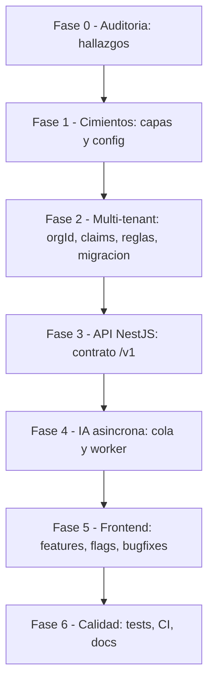
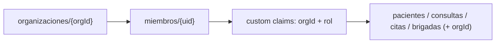
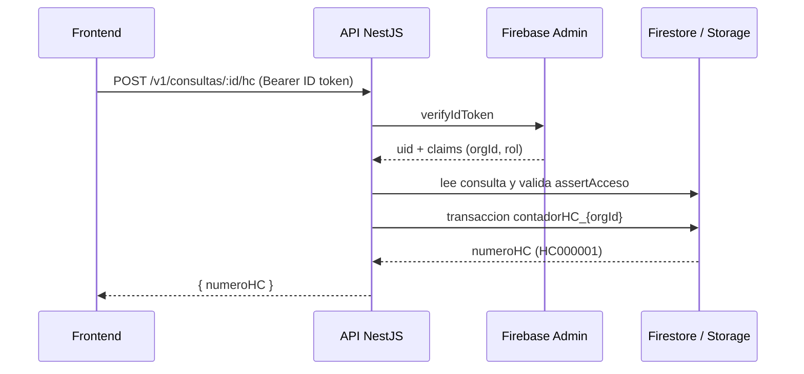
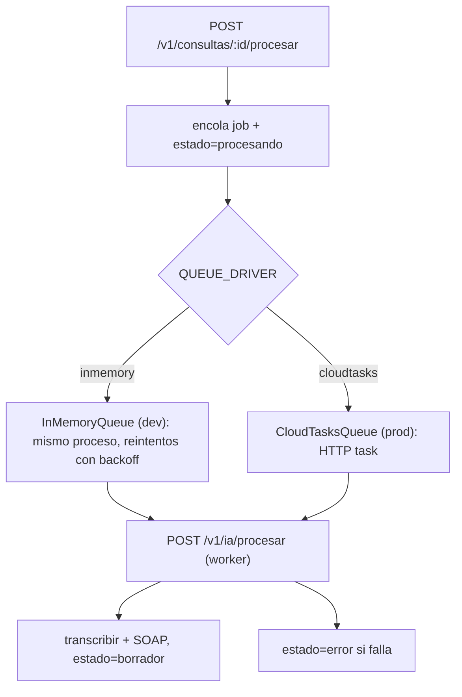
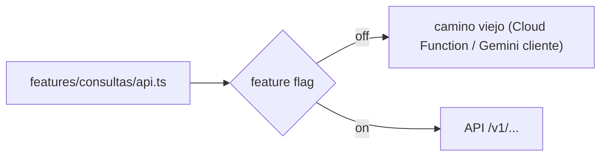
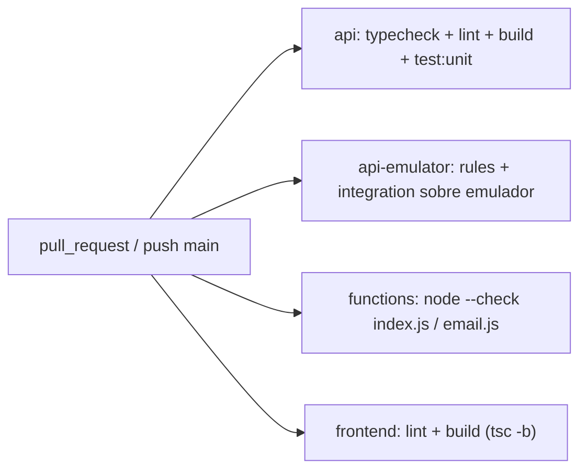

# VetIA — Refactorización paso a paso

> El documento estrella. Acá te contamos, en orden y sin vueltas, **todo** lo que se hizo en
> esta refactorización: qué problema había, qué se cambió, qué archivos se tocaron y cómo
> verificarlo. Si sos dev nuevo y querés entender qué pasó y por qué, empezá por acá.

La idea grande: VetIA arrancó como una app Firebase "todo desde el navegador" (React + Firestore
directo + Cloud Functions + la API key de Gemini expuesta en el cliente). Funcionaba, pero tenía
deuda que iba a explotar al crecer: numeración de historias clínicas con contención global, un
solo "tenant" implícito, secretos en el front y componentes gigantes imposibles de testear.

La estrategia elegida fue **Strangler Fig**: montamos una API NestJS *por encima* de Firebase y
movimos responsabilidades de a poco, **sin romper la app actual**. El frontend trae feature flags
**apagados por defecto**, así que el comportamiento es idéntico hasta que decidas encender cada
camino nuevo. Cero big-bang.

---

## Índice

- [Antes vs después (resumen)](#antes-vs-después-resumen)
- [Mapa de fases](#mapa-de-fases)
- [Fase 0 — Auditoría: qué estaba mal](#fase-0--auditoría-qué-estaba-mal)
- [Fase 1 — Cimientos: capas y configuración](#fase-1--cimientos-capas-y-configuración)
- [Fase 2 — Multi-tenant: orgId, claims, reglas y migración](#fase-2--multi-tenant-orgid-claims-reglas-y-migración)
- [Fase 3 — API NestJS: el contrato /v1](#fase-3--api-nestjs-el-contrato-v1)
- [Fase 4 — IA asíncrona: cola y worker](#fase-4--ia-asíncrona-cola-y-worker)
- [Fase 5 — Frontend: features, flags y bugfixes](#fase-5--frontend-features-flags-y-bugfixes)
- [Fase 6 — Calidad: tests, CI y docs](#fase-6--calidad-tests-ci-y-docs)
- [Checklist de logros](#checklist-de-logros)
- [Estado real de build y tests](#estado-real-de-build-y-tests)
- [Pendientes (requieren entorno externo)](#pendientes-requieren-entorno-externo)

---

## Antes vs después (resumen)

| Tema | Antes | Después |
|---|---|---|
| Numeración HC | `configuracion/contadorHC` **global** (un solo doc → contención bajo carga) | Contador **por clínica** `configuracion/contadorHC_{orgId}`, transaccional, formato `HC000001` |
| Multi-tenant | No existía; todo colgaba de `veterinarioId` | `organizaciones/{orgId}` + `miembros/{uid}` + custom claims `{ orgId, rol }`; `orgId` en pacientes/consultas/citas/brigadas |
| Autorización | Reglas básicas por `veterinarioId` | Reglas por **owner + tenant** con fallback legacy; chequeo server-side (`assertAcceso`) en la API |
| Secreto de Gemini | **Expuesto en el navegador** (`VITE_GEMINI_API_KEY`) | Server-side (`GEMINI_API_KEY` en `api/` y `functions/`); el front pega a la API |
| Email | Gmail **hardcodeado** / `functions.config()` | Adaptador SendGrid/SMTP con `defineSecret` (Functions) y env (API) + rate limit |
| IA en consultas | Llamadas a Gemini desde el navegador, bloqueante | Pipeline async vía cola (in-memory en dev, Cloud Tasks en prod) con reintentos y estado `error` |
| Frontend | `DetalleConsulta.tsx` de ~850 líneas, lógica mezclada con UI | ~374 líneas + 4 subcomponentes; PDF/sharing/api separados; capas `lib/` y `features/` |
| Auth del front | **Fail-open** (si fallaba la whitelist, dejaba pasar) | **Fail-closed** (si falla la lectura de la whitelist, no deja pasar) |
| Tests | Prácticamente ninguno | 54 tests Vitest (front) + 12 unit Jest (api) + reglas/integración en CI + e2e Playwright |
| CI | No había | `.github/workflows/ci.yml` con 4 jobs (api, api-emulator, functions, frontend) |

---

## Mapa de fases



> El trabajo real corrió en **dos frentes en paralelo** (backend/infra y frontend). Las fases de
> abajo ordenan el relato para que se entienda; no son estrictamente secuenciales en el tiempo.

---

## Fase 0 — Auditoría: qué estaba mal

Antes de tocar nada, se identificaron los dolores que justifican toda la refactorización:

1. **Contención en la numeración de HC.** Un único documento `configuracion/contadorHC` recibía
   *todas* las transacciones de numeración. Cada historia clínica nueva, de cualquier veterinario,
   peleaba por el mismo doc. Bajo carga eso es un cuello de botella clásico de Firestore (límite
   práctico de ~1 escritura/segundo sostenida por documento).

2. **Sin multi-tenant.** No existía el concepto de "clínica/organización". Todo colgaba de
   `veterinarioId`. Imposible compartir pacientes entre colegas de la misma clínica o separar
   datos por organización de forma limpia.

3. **Secreto de Gemini en el cliente.** La API key viajaba al navegador vía `VITE_GEMINI_API_KEY`.
   Cualquiera con devtools la veía. Riesgo real de abuso/costo.

4. **Email frágil.** Credenciales de Gmail hardcodeadas / vía `functions.config()` (deprecado).
   Sin rate limit. Sin proveedor profesional.

5. **Componentes gigantes.** `DetalleConsulta.tsx` rondaba las **850 líneas** mezclando carga de
   datos, generación de PDF, envío por email/WhatsApp y un montón de UI. Intesteable.

6. **Auth fail-open.** Si la lectura de la whitelist de acceso fallaba, el código **dejaba pasar**.
   Lo seguro es lo contrario.

7. **Bugs latentes:** la talla nunca se guardaba en el paciente (`ultimaTalla`), se usaba
   `user.displayName` (que no existe en el tipo `Veterinario`), el prefijo de WhatsApp estaba
   clavado en `57`, y cuando Gemini fallaba la nota quedaba marcada como si fuera generada por IA.

> Estos hallazgos son la brújula: cada fase ataca uno o varios de estos puntos.

---

## Fase 1 — Cimientos: capas y configuración

**Problema que ataca:** no había estructura donde apoyar el código nuevo, ni configuración de
emuladores para desarrollar/test sin tocar la nube.

**Qué se hizo:**

- **Infra Firebase declarada en la raíz.** `firebase.json` ahora declara firestore (rules +
  indexes), storage (rules), functions y **emuladores**: auth `9099`, firestore `8080`,
  storage `9199`, functions `5001`, UI `4000` (`singleProjectMode: true`).
- **Capa `lib/` en el frontend** (la base reusable):
  - `firebase.ts` — init único de Firebase (app, auth, db, storage, googleProvider).
  - `apiClient.ts` — instancia axios con interceptor que inyecta `Authorization: Bearer <ID token>`.
  - `featureFlags.ts` — lectura tipada de los flags Strangler Fig.
  - `errors.ts` — `AppError` con `code` + `cause` y helpers (`getErrorMessage`, `toAppError`).
  - `mappers.ts` — conversión `Timestamp <-> Date` (`toDate`, `toTimestamp`, `mapDates`, ...).
  - `orgContext.ts` — resolución de la organización del usuario (dejado listo, aún no cableado a la UI).
- **Capa `common/` en la API**: `config/env.ts` (toda la config por env, tipada), `firebase/`
  (FirebaseService como módulo global + `collections.ts`), `auth/` (guards y decoradores).

**Archivos clave:**

```
firebase.json
frontend/src/lib/{firebase,apiClient,featureFlags,errors,mappers,orgContext}.ts
api/src/common/config/env.ts
api/src/common/firebase/{firebase.service.ts,firebase.module.ts,collections.ts}
```

**Cómo verificarlo:**

```powershell
firebase emulators:start --project vethosia-production   # UI en http://localhost:4000
cd frontend; npm run typecheck                    # tsc -b sin errores
cd api; npm run typecheck                          # tsc --noEmit sin errores
```

---

## Fase 2 — Multi-tenant: orgId, claims, reglas y migración

**Problema que ataca:** hallazgos #1 (contención) y #2 (sin tenant), más el endurecimiento de
autorización.

**El modelo:**



- `organizaciones/{orgId}`: `{ nombre, plan, ciudad?, creadoEn }`.
- `miembros/{uid}`: `{ orgId, rol: 'admin' | 'vet' | 'asistente', creadoEn }`.
- **Custom claims** `{ orgId, rol }` en el token de Firebase Auth, seteados por la API al
  crear org / asignar miembro. Así el aislamiento viaja en el propio ID token.
- Las colecciones de negocio ganan `orgId`, pero se **mantiene `veterinarioId`** por compatibilidad
  (fallback legacy).

**Reglas de seguridad (doble modo).** `firestore.rules` aísla primero por `orgId`
(`request.auth.token.orgId`) y, si el doc todavía no tiene `orgId`, cae al dueño legacy
(`veterinarioId == uid`). Puntos finos:

- El **contador HC no es escribible desde el cliente** (`configuracion/{docId}`: `write: if false`).
  Solo lo toca el Admin SDK (API/Functions), que se salta las reglas.
- `storage.rules`: `audios/{uid}/**` solo del dueño, máx **50 MB**, content-type `audio/.*`;
  `historiales/{orgId}/**` lectura por org (write solo API); `fotos-pacientes/{orgId}/{pacienteId}/**`
  lectura/escritura por miembros de la org (máx **10 MB**, `image/.*`); legacy `fotos-pacientes/{uid}/{pacienteId}`.
- `firestore.indexes.json`: índices compuestos para las dos variantes (por `veterinarioId` legacy
  y por `orgId`) en `consultas`, `pacientes` y `citas`.

**Migración idempotente y reversible** (`api/scripts/migrate.ts`):

1. Crea/reusa la org por defecto (`MIGRATION_ORG_ID` / `MIGRATION_ORG_NOMBRE`).
2. Crea `miembros` desde los `veterinarios` existentes (el primero `admin`, el resto `vet`) y
   setea sus custom claims.
3. Backfillea `orgId` en `pacientes`, `consultas`, `citas`, `brigadas` (saltea lo que ya lo tiene).

El `--revert` deshace todo lo marcado con `_migradoPor`. `seed-emulator.ts` siembra datos de
ejemplo (y **se niega a correr** si no hay `FIRESTORE_EMULATOR_HOST`, para no pisar prod).

**Archivos clave:**

```
firestore.rules
storage.rules
firestore.indexes.json
api/src/modules/tenant/{tenant.controller.ts,tenant.service.ts,dto/*.ts}
api/src/common/auth/access.ts
api/scripts/{migrate.ts,seed-emulator.ts}
```

**Cómo verificarlo:**

```powershell
firebase emulators:start --only firestore,auth,storage --project vethosia-production
# en otra terminal:
cd api
$env:FIRESTORE_EMULATOR_HOST="127.0.0.1:8080"; $env:GCLOUD_PROJECT="vethosia-production"
npm run seed:emulator
npm run migrate
npm run migrate -- --revert   # rollback
npm run test:rules            # valida el aislamiento por tenant/rol
```

---

## Fase 3 — API NestJS: el contrato /v1

**Problema que ataca:** mover lógica sensible (HC, IA, PDF, email) fuera del navegador y detrás
de un contrato versionado y autenticado.

**Bootstrap** (`api/src/main.ts`): prefijo global `/v1`, `ValidationPipe` global
(`whitelist + transform`), CORS configurable por env, escucha en `0.0.0.0:PORT` (Cloud Run inyecta
`PORT`). Dos guards globales: `AuthGuard` (verifica el ID token y carga `{ orgId, rol }`) y
`RolesGuard` (aplica `@Roles(...)`). Todo cerrado salvo lo marcado `@Public()`.

**Flujo de un request:**



**Módulos y lo más jugoso de cada uno:**

- **health** — `GET /v1/health` público, devuelve `{ status, time }`. El load balancer lo usa.
- **consultas** — `POST /v1/consultas/:id/{hc,pdf,email,procesar}`.
  - `hc.service.ts`: numeración **por clínica**. El contador es `configuracion/contadorHC_{tenant}`
    (donde `tenant = orgId` o `vet_{uid}` en legacy), transaccional, formato `HC000001`. Esto
    **mata la contención del doc global**. Es idempotente: si la consulta ya tiene `numeroHC`, lo
    devuelve sin renumerar.
  - `pdf.service.ts`: arma el PDF con **pdfkit**, lo sube a `historiales/{consultaId}.pdf` y
    devuelve una **signed URL** temporal.
- **ia** — `/v1/ia/transcribir`, `/v1/ia/soap`, `/v1/ia/procesar` (worker). Gemini server-side,
  tipado, soporta `audioPath` de Storage o `audioBase64`. (Detalle de la cola en la Fase 4.)
- **email** — adaptador SendGrid/SMTP, rate limit en memoria por destinatario, validación.
- **storage** — `subirBuffer`, `descargar`, `signedUrl` (en emulador devuelve URL directa).
- **tenant** — `POST /v1/organizaciones` (crea org y te deja `admin`),
  `POST /v1/organizaciones/:orgId/miembros` (alta + custom claims, solo `admin` de esa org),
  `GET /v1/organizaciones/me`.

**Autorización fina** (`common/auth/access.ts`): `puedeAccederDoc` compara `orgId` del usuario vs
del doc, con fallback legacy a `veterinarioId == uid`. `assertAcceso` tira `403` si no matchea.

**Archivos clave:**

```
api/src/main.ts
api/src/app.module.ts
api/src/modules/**/* (health, consultas, ia, email, storage, tenant)
api/src/common/auth/{auth.guard.ts,roles.guard.ts,access.ts,*.decorator.ts}
api/Dockerfile
```

**Cómo verificarlo:**

```powershell
cd api
npm run build        # compila a dist/
npm run test:unit    # 12 tests verdes (hc, access, gemini)
npm run start:dev
# en otra terminal:
curl http://localhost:8080/v1/health
```

---

## Fase 4 — IA asíncrona: cola y worker

**Problema que ataca:** procesar audio con Gemini desde el navegador era bloqueante y frágil; si
algo fallaba, la consulta quedaba en un limbo.

**Diseño:** el pipeline de IA se desacopla con una **cola**, seleccionable por env `QUEUE_DRIVER`:



- **`inmemory` (default, dev/test):** procesa en background en el mismo proceso. Hasta 3 intentos
  con backoff exponencial (`500 * 2^intento` ms).
- **`cloudtasks` (prod):** encola en Cloud Tasks, que hace `POST` a `IA_WORKER_URL`
  (`/v1/ia/procesar`). Soporta OIDC (`CLOUD_TASKS_INVOKER_SA`) y/o header `x-worker-secret`.
- El worker `/v1/ia/procesar` está protegido por `WorkerGuard`: si `IA_WORKER_SECRET` no está
  seteado deja pasar (dev/emulador); si está, exige el header.
- **Sin consultas huérfanas:** al encolar se marca `estado: 'procesando'`; al terminar bien queda
  `'borrador'`; si falla, queda `'error'` (visible en la UI), no en un limbo silencioso.

**Archivos clave:**

```
api/src/modules/ia/ia.controller.ts
api/src/modules/ia/ia.service.ts
api/src/modules/ia/queue/{queue.interface.ts,in-memory-queue.service.ts,cloud-tasks-queue.service.ts,ia-processor.ts}
api/src/modules/ia/worker.guard.ts
api/loadtest/hc.js
```

**Cómo verificarlo:**

```powershell
cd api
$env:QUEUE_DRIVER="inmemory"
npm run start:dev
# disparar /v1/consultas/:id/procesar y mirar cómo la consulta pasa procesando -> borrador
```

---

## Fase 5 — Frontend: features, flags y bugfixes

**Problema que ataca:** hallazgos #5 (componentes gigantes), #6 (fail-open) y #7 (bugs), más el
cableado del Strangler Fig en el cliente.

**Reorganización por feature.** Se crearon `src/features/{auth,pacientes,consultas,brigadas}` con
`api.ts` (acceso a datos) y `hooks.ts/tsx` (estado de React), más `src/shared/` (barrel de
componentes). Las rutas viejas (`src/hooks/*`, `src/services/firebase.ts`) quedaron como **shims de
re-export** para no romper imports existentes.

**El Strangler Fig en acción** (`features/consultas/api.ts`): cada operación elige camino según un
flag. Apagado = comportamiento viejo (Cloud Functions + Gemini en el navegador). Encendido = API.



| Operación | Flag | On = API |
|---|---|---|
| Numerar HC | `VITE_USE_API_HC` | `POST /v1/consultas/:id/hc` |
| Transcribir + SOAP | `VITE_USE_API_IA` | `/v1/ia/transcribir` + `/v1/ia/soap` |
| PDF + email | `VITE_USE_API_DOCS` | `/v1/consultas/:id/pdf` y `/email` |

> **Nota de verdad incómoda:** el `.env.example` viejo listaba `VITE_USE_API_EMAIL` y
> `VITE_USE_API_PDF` por separado, pero el código lee un único `VITE_USE_API_DOCS` para ambos.
> Se corrigió el `.env.example` para que refleje lo que el código realmente usa.

**`DetalleConsulta` partido en pedazos** (de ~850 a **~374 líneas**):

- `features/consultas/pdf.ts` — PDF puro (`buildHistoriaClinicaModel` testeable + `renderHistoriaClinicaPDF`).
- `features/consultas/sharing.ts` — WhatsApp (número, mensaje, URL `wa.me`).
- `features/consultas/api.ts` — la capa Strangler.
- 4 subcomponentes UI: `ColumnaIzquierda`, `ConsultaActions`, `PanelSignosVitales`, `PanelMedicamentos`.

**Bugs arreglados (hallazgo #7):**

1. **Talla canónica.** Se agregó el campo `talla` al form de signos vitales y se propaga a
   `paciente.ultimaTalla` al aprobar (antes leía `talla/altura` que nadie producía).
   `features/consultas/types.ts`, `data.ts`, `components/PanelSignosVitales.tsx`, `pdf.ts`.
2. **`user.nombre`** en vez de `user.displayName` (que no existe en el tipo `Veterinario`).
   `pages/DetalleConsulta.tsx`.
3. **Prefijo de WhatsApp configurable:** `propietario.codigoPais` > `VITE_WHATSAPP_COUNTRY_CODE` >
   `57`. `features/consultas/sharing.ts`.
4. **Fallback de Gemini honesto:** si la IA falla, la nota queda con `generadoPorIA: false` y la UI
   muestra un **banner ámbar** ("Nota no estructurada por IA..."). `services/gemini.ts`,
   `features/consultas/hooks.ts`, `pages/DetalleConsulta.tsx`.

**Otros endurecimientos:** auth **fail-closed** (si falla la lectura de la whitelist, no deja
pasar), **optimistic updates** en vez de refetch total, eliminación del `config/firebase.ts`
duplicado, y cero `any` nuevos.

**Archivos clave:**

```
frontend/src/features/**/* (auth, pacientes, consultas, brigadas)
frontend/src/lib/featureFlags.ts
frontend/src/pages/DetalleConsulta.tsx
frontend/src/features/consultas/{pdf.ts,sharing.ts,api.ts,components/*.tsx}
frontend/src/services/gemini.ts
```

**Cómo verificarlo:**

```powershell
cd frontend
npm run typecheck        # tsc -b
npm run build            # vite build (verde)
npm run test:run         # 54 tests Vitest
```

---

## Fase 6 — Calidad: tests, CI y docs

**Problema que ataca:** sin red de seguridad no se refactoriza tranquilo. Y sin docs, nadie nuevo
entiende nada.

**Tests.** Estrategia en capas (detalle completo en [TESTING.md](./TESTING.md)):

- **Caracterización** (front): fijan el comportamiento *actual* antes de tocarlo — parsing de
  `generateSOAP`, `transcribeAudio`, la secuencia de `procesarAudioConsulta`, la whitelist de auth
  y un golden snapshot del PDF.
- **Unit** (front): `mappers`, `apiClient`, `featureFlags`, `pdf`, `sharing`, `hooks`.
- **Unit** (api): `access`, `hc.service` (formato + idempotencia + cross-tenant), `gemini.service`.
- **Reglas** (api, emulador): mismo/otro tenant, sin auth, por rol, contador no escribible.
- **Integración** (api, emulador): 20 numeraciones de HC concurrentes → números únicos y contiguos.
- **e2e** (Playwright): `smoke.spec.ts` activo; `flujo-principal.spec.ts` como `fixme` documentado.
- **Carga** (k6): `loadtest/hc.js`, 10k VUs en orgs distintas contra `/hc`.

**CI** (`.github/workflows/ci.yml`), 4 jobs en cada PR y push a `main`:



**Docs.** Esta carpeta `docs/` + READMEs reescritos. Ver el [índice](#índice) y el README raíz.

**Cómo verificarlo:** abrí cualquier PR y mirá los 4 checks en verde, o corré localmente los
scripts de cada paquete.

---

## Checklist de logros

- [x] Estrategia Strangler Fig montada, flags **apagados por defecto** (comportamiento idéntico).
- [x] API NestJS con contrato `/v1` autenticado (Bearer ID token) y guards globales fail-closed.
- [x] Numeración de HC **por clínica** (`contadorHC_{orgId}`), transaccional, sin contención global.
- [x] Modelo multi-tenant: `organizaciones`, `miembros`, custom claims, `orgId` en colecciones.
- [x] Reglas de Firestore/Storage con aislamiento owner+tenant y fallback legacy.
- [x] Migración idempotente con `--revert` + seed de emulador.
- [x] Gemini y email fuera del cliente; email con adaptador SendGrid/SMTP + secrets + rate limit.
- [x] Pipeline de IA asíncrono con cola intercambiable (in-memory / Cloud Tasks) y estado `error`.
- [x] Frontend reorganizado en `lib/` + `features/`; `DetalleConsulta` de ~850 a ~374 líneas.
- [x] 4 bugs reales arreglados (talla, nombre del vet, prefijo WhatsApp, fallback IA honesto).
- [x] Auth fail-closed, optimistic updates, shims de re-export, sin `any` nuevos.
- [x] Suite de tests (caracterización + unit + reglas + integración + e2e + k6).
- [x] CI con 4 jobs y documentación completa en `docs/`.

---

## Estado real de build y tests

| Frente | Comando | Estado |
|---|---|---|
| Frontend typecheck/build | `tsc -b && vite build` | Verde |
| Frontend tests | `vitest run` | **54 tests verdes** |
| API typecheck/lint/build | `npm run typecheck/lint/build` | OK |
| API unit | `npm run test:unit` | **12 tests verdes** |
| API reglas/integración | `npm run test:rules` / `test:integration` | Verdes **en CI** (necesitan emulador) |
| Functions | `node --check index.js / email.js` | OK |

---

## Pendientes (requieren entorno externo)

Honestidad ante todo: hay cosas que no se pudieron ejecutar en la máquina de desarrollo y quedan
documentadas para correr en su entorno (GCP / CI):

- **Deploy a Cloud Run** y **crear la cola de Cloud Tasks** (`gcloud tasks queues create vetia-ia`):
  requieren credenciales GCP. Comandos en el [RUNBOOK](./RUNBOOK.md).
- **k6 real (10k VUs)** y **tests de reglas/integración**: necesitan k6 / emuladores; corren en el
  job `api-emulator` del CI.
- **Navegadores de Playwright no instalados** localmente (disco/red): `npm run e2e:install` pendiente.
- **Fix del binding nativo de rolldown** (Vite 8) fue necesario para que el build pasara — ver
  troubleshooting en el [RUNBOOK](./RUNBOOK.md#troubleshooting).
- Quedan **21 warnings de lint preexistentes** en `pages/` no tocadas (no se introdujeron nuevos).

---

> ¿Querés profundizar? Seguí con [ARQUITECTURA](./ARQUITECTURA.md), [DATA-MODEL](./DATA-MODEL.md),
> [API](./API.md), [RUNBOOK](./RUNBOOK.md), [TESTING](./TESTING.md) y los
> [ADRs](./ADR/).
