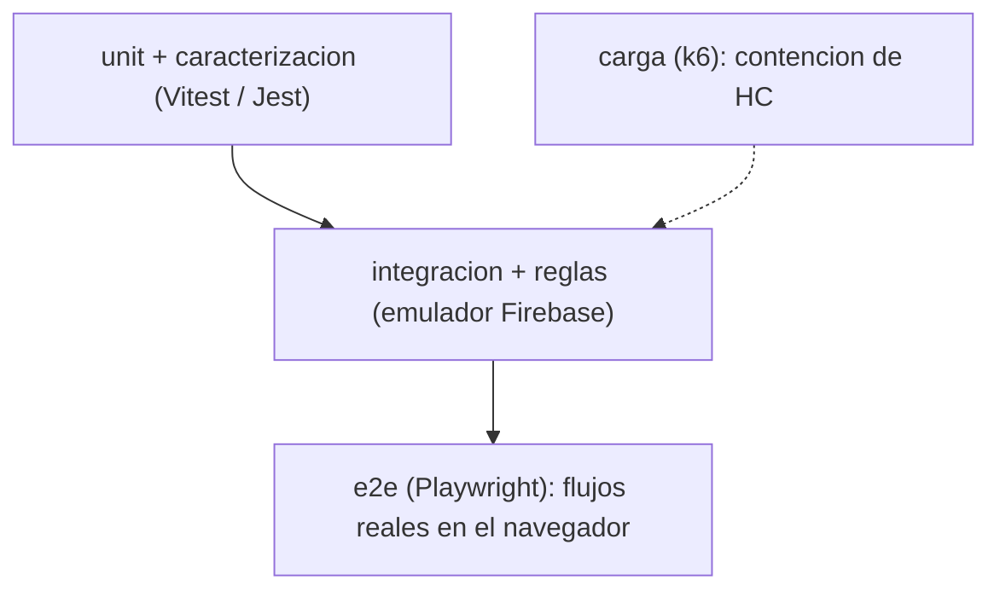
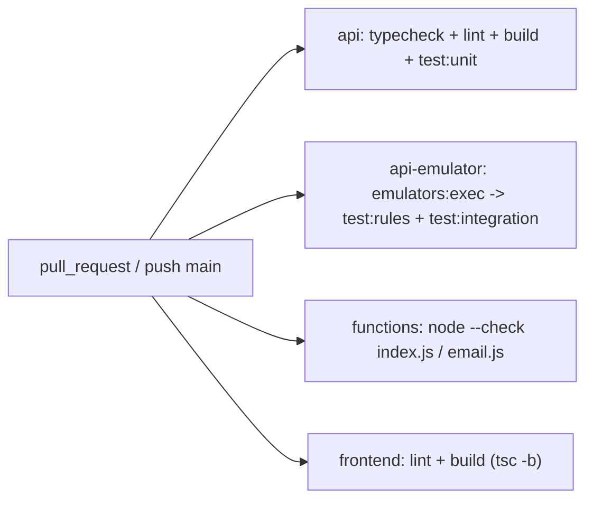

# Testing en VetIA

Cómo está armada la red de seguridad: qué tipo de tests hay, qué cubre cada uno, cómo correrlos y
la convención de comentarios estilo humano que usamos en todo el proyecto.

Filosofía: como esto es una refactorización sobre código vivo, primero **fijamos el comportamiento
actual** (tests de caracterización) y recién después tocamos. Así, si algo cambia sin querer, el
test grita.

---

## Pirámide de pruebas



| Capa | Dónde | Runner | Necesita |
|---|---|---|---|
| Caracterización | `frontend/src/**` | Vitest | nada |
| Unit (front) | `frontend/src/**` | Vitest | nada |
| Unit (api) | `api/test/unit` | Jest | nada |
| Reglas | `api/test/rules` | Jest | emulador Firebase |
| Integración | `api/test/integration` | Jest | emulador Firebase |
| e2e | `frontend/e2e` | Playwright | navegadores + (idealmente) emulador |
| Carga | `api/loadtest/hc.js` | k6 | k6 + API desplegada |

---

## Tests de caracterización (frontend)

Fijan el comportamiento del código legacy **tal como está hoy**, antes de moverlo. Son el seguro de
la refactorización.

| Archivo | Qué fija |
|---|---|
| `src/services/gemini.test.ts` | `parseGeminiJSON` (JSON limpio, con backticks, con texto alrededor, null), `normalizeResultadoSOAP`, `buildFallbackResultado`, y `generateSOAP` con axios mockeado (retry + fallback `generadoPorIA:false`) + snapshot |
| `src/services/whisper.test.ts` | `transcribeAudio`: texto recortado, vacío, errores de API, sin candidatos |
| `src/features/consultas/hooks.test.tsx` | la secuencia de `procesarAudioConsulta`: `procesando -> borrador`, llamadas a transcribir + SOAP, persistencia de `generadoPorIA`, y error de transcripción → estado `error` |
| `src/features/auth/hooks.test.tsx` | la whitelist de acceso: permite email listado, permite lista vacía, deniega no listado, **fail-closed** ante error de lectura |
| `src/features/consultas/pdf.test.ts` | golden snapshot de `buildHistoriaClinicaModel` (incluye talla, fallbacks de vet/paciente) + smoke de `renderHistoriaClinicaPDF` |

---

## Tests unitarios (frontend)

| Archivo | Qué cubre |
|---|---|
| `src/lib/featureFlags.test.ts` | defaults en `false`; parsea `true/1/on/yes`; inválido → `false` |
| `src/lib/apiClient.test.ts` | inyecta Bearer si hay sesión; sin header si no; baseURL definida |
| `src/lib/mappers.test.ts` | `toDate`, `toDateOrNull`, `serializeDate`, `mapDates` |
| `src/features/consultas/sharing.test.ts` | prioridad del código de país, armado del número y mensaje de WhatsApp, URL `wa.me` |

### Correr los tests del frontend

```powershell
cd frontend
npm run test            # vitest watch
npm run test:run        # una corrida (CI). 54 tests verdes
npm run coverage        # con cobertura v8
```

---

## Tests unitarios (API)

| Archivo | Qué cubre |
|---|---|
| `api/test/unit/access.spec.ts` | `puedeAccederDoc` y `particionTenant`: mismo tenant OK, otro tenant denegado, fallback legacy por vet |
| `api/test/unit/hc.service.spec.ts` | formato `HC000001`, incremento del contador, idempotencia, `ForbiddenException` cross-tenant (Firestore mockeado) |
| `api/test/unit/gemini.service.spec.ts` | parsing de JSON con backticks, normalización de prioridad, fallback SOAP, trim de transcripción (axios mockeado) |

```powershell
cd api
npm run test:unit       # 12 tests verdes, no necesitan emulador
```

---

## Tests de reglas (API, emulador)

`api/test/rules/firestore.rules.spec.ts` valida `firestore.rules` de verdad contra el emulador:

- lectura **mismo tenant** OK, **otro tenant** denegada, **sin auth** denegada,
- acceso **legacy** por veterinario,
- el **contador HC no es escribible** desde el cliente,
- `asistente` **no** puede borrar; `admin` sí.

```powershell
cd api
firebase emulators:exec --project vethosia-production --only firestore,storage,auth "npm run test:rules"
```

---

## Tests de integración (API, emulador)

`api/test/integration/hc.integration.spec.ts`: dispara **20 numeraciones de HC concurrentes**
contra el emulador y verifica que salgan números **únicos y contiguos** (1..N). Esta es la prueba
real de que la numeración por clínica no se pisa bajo concurrencia.

```powershell
cd api
firebase emulators:exec --project vethosia-production --only firestore,storage,auth "npm run test:integration"
```

> Sin emulador, los tests de reglas e integración se **saltan** solos. En CI corren en el job
> `api-emulator`.

---

## e2e (Playwright)

`frontend/e2e/`:

| Archivo | Estado |
|---|---|
| `smoke.spec.ts` | **activo** — sin login, `/` redirige a `/login` y muestra "Bienvenido de nuevo" + botón de Google |
| `flujo-principal.spec.ts` | **`test.fixme`** — esqueleto documentado del flujo completo (login → paciente → consulta con audio → aprobar → PDF); requiere emulador + mock de Gemini |

```powershell
cd frontend
npm run e2e:install     # instala Chromium (una vez)
npm run e2e             # playwright test
```

Config: `playwright.config.ts` (Chromium, `baseURL http://localhost:5173`, levanta `npm run dev`).

---

## Carga (k6)

`api/loadtest/hc.js` simula la **contención del contador**: hasta **10.000 VUs** en organizaciones
distintas pegándole a `POST /v1/consultas/:id/hc`.

- Escenario `ramping-vus`: 1m→1000, 2m→10000, 2m→10000, 1m→0.
- Thresholds: `p(95) < 800ms`, `hc_errores < 50`.

```powershell
$env:API_URL="https://<tu-api>"; $env:TOKEN="<id-token>"
k6 run api/loadtest/hc.js
```

> Requiere k6 instalado y una API accesible. No se ejecutó en la máquina de dev; queda listo para
> correr en un entorno con GCP.

---

## CI

`.github/workflows/ci.yml` corre en cada PR y push a `main`, 4 jobs en paralelo:



---

## Convención de comentarios estilo humano

Regla de oro: **el comentario explica el PORQUÉ, no el QUÉ.** El código ya dice qué hace; el
comentario está para el contexto que no se ve: una decisión, un trade-off, un bug que arreglamos, una
trampa a evitar. Tono informal, como le explicás a un colega.

**Sí (explican intención / contexto):**

```ts
// talla agregado: antes faltaba y por eso paciente.ultimaTalla nunca se llenaba
{ field: 'talla', label: 'Talla (cm)', step: 0.1 },
```

```ts
// los claims pueden no existir todavia (usuario legacy sin org).
orgId: typeof decoded.orgId === 'string' ? decoded.orgId : undefined,
```

```
// Ojo: NUNCA dejes el contador escribible desde el cliente o cualquiera puede
// pisar la numeracion de historias clinicas.
```

```ts
// BUGFIX: antes usaba user.displayName, que no existe en el tipo Veterinario.
nombreVet: user?.nombre || 'Veterinario',
```

**No (narran lo obvio, ruido):**

```ts
// incrementa el contador
contador = contador + 1;

// importa axios
import axios from 'axios';
```

Etiquetas que usamos cuando ayudan: `BUGFIX:` (qué se arregló y por qué fallaba), `Ojo:` /
`IMPORTANTE:` (trampa a evitar), y notas de compatibilidad legacy donde el código convive con lo
viejo. Para deuda futura, `TODO:` con una frase de qué falta.

---

> Relacionado: [RUNBOOK](./RUNBOOK.md) (levantar emuladores) y [PASO-A-PASO](./PASO-A-PASO.md#fase-6--calidad-tests-ci-y-docs).
